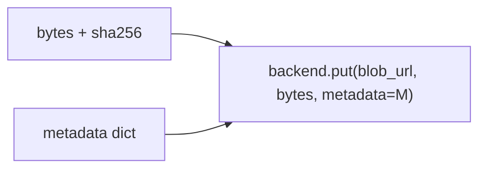

# Blob-Metadaten stempeln

> **Aufgabe.** Beim Schreiben eines Payload-Blobs Storage-seitige
> Metadaten setzen, mit denen sich das Blob jederzeit seinem
> Workflow-Schritt zuordnen lässt, auch ohne Envelope.

## Warum

Der Envelope reist durch Temporal, Tracing Backend und Logs. Das Blob
liegt **länger** als alle drei (Retention, Compliance, Audit). Ohne
Metadata-Stempel ist ein gefundenes Blob anonym: nicht zurückführbar,
nicht zuordenbar.

## Pflichtattribute

Exakt diese fünf Keys, snake_case:

| Key               | Wert                                                     |
| ----------------- | -------------------------------------------------------- |
| `workflow_id`     | deterministische Workflow-ID                             |
| `run_id`          | Temporal Run-ID (beim Ingress-Blob ggf. `""`)            |
| `step_id`         | logischer Aktivitätsschritt                              |
| `schema_version`  | Semver, z. B. `1.0`                                      |
| `idempotency_key` | `{business_tx_id}:{step_id}:{schema_version}`            |

`business_tx_id` steckt im Blob-Pfad
(`workflows/{business_tx_id}/…`) und muss nicht zusätzlich als Metadata
gesetzt werden; ein zusätzlicher Key schadet aber nicht.

## Schreibpfad



Die Metadaten werden **zusammen** mit den Bytes geschrieben, in einer
einzigen Operation. Zweistufige Writes (Bytes, dann Metadata-Patch)
doppeln die Round-Trips und riskieren inkonsistente Zustände bei
Fehlschlag zwischen den Schritten.

## Readback

Über die Properties-API des Backends:

```text
props = backend.head(blob_url)
metadata = props.metadata  # dict[str, str]
```

Typische Forensik-Queries:

- Alle Blobs eines Workflows: Prefix-Listing auf
  `workflows/{business_tx_id}/` plus Metadata-Read.
- Blobs eines bestimmten Schritts: Metadata-Filter auf `step_id`
  (falls das Backend serverseitige Filter unterstützt; sonst
  clientseitig).

## Casing und Zeichensatz

Storage Backends normalisieren Metadata-Keys uneinheitlich. Regeln:

- Keys **immer** snake_case, Lowercase.
- Werte sind UTF-8-Strings. Binärdaten, Zeilenumbrüche und
  Steuerzeichen vermeiden.
- Kein PII in Metadata; Metadata ist bei Listings oft sichtbar.

## Häufige Fehler

- **Metadata-Patch nach dem Upload.** Doppelter Round-Trip; bei Fehlern
  zwischen Put und Patch bleibt ein Blob ohne Stempel.
- **Unterschiedliche Key-Namen pro Service.** Forensik bricht zusammen,
  sobald ein Service `stepId` statt `step_id` schreibt.
- **PII in Metadata.** Werte landen in Listings, Logs, Metriken. Für
  Fachdaten ist das Blob selbst zuständig.
- **`run_id` = `""` akzeptieren.** Für das Ingress-Blob unvermeidlich
  (Blob entsteht vor `StartWorkflow`); ab Schritt 1 muss der echte
  `run_id` drinstehen.

## Siehe auch

- [Reference: Regeln](../../reference/regeln.md) (B-3)
- [Reference: Korrelationsattribute](../../reference/korrelationsattribute.md)
- [Guide: Payload schreiben](payload-schreiben.md)
