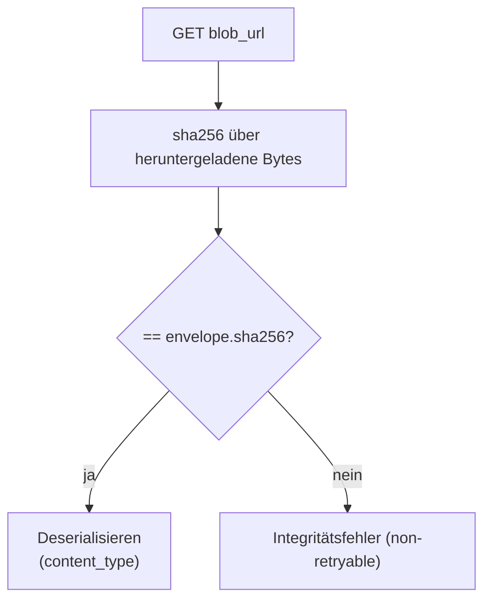

# Payload lesen und verifizieren

> **Aufgabe.** Eine Nutzlast aus Blob Storage laden und ihre Integrität
> gegen den im Envelope mitgelieferten `sha256` prüfen, bevor sie
> fachlich verarbeitet wird.

## Vertragsoberfläche

Nach einem erfolgreichen Read-and-Verify gilt:

1. Die heruntergeladenen Bytes entsprechen exakt dem, was der
   Uploader hochgeladen hat.
2. Der `sha256` im Envelope ist verifiziert; Mismatch ist ein
   **non-retryable** Fehler.
3. Der Payload ist gegen das im `content_type` benannte Format
   deserialisiert.

## Ablauf

## Schritte

1. **Download.** Bytes vollständig laden (oder streamen und gleichzeitig
   hashen, je nach Backend-Fähigkeit).

2. **Hash berechnen.** SHA-256, Hex-Digest, lowercase. Exakt dasselbe
   Verfahren wie beim Upload, sonst matcht nichts.

3. **Abgleich.** Zeichenweiser Vergleich (oder `hmac.compare_digest`
   bzw. äquivalent).

4. **Bei Mismatch.** Als dedizierter Integritätsfehler werfen
   (z. B. `IntegrityError`), markiert als non-retryable. Retry würde
   denselben korrupten Zustand liefern; die Ursache liegt entweder im
   Upload oder im Storage selbst.

   Den **exakten** Klassennamen kennen: Temporal matcht
   `non_retryable_error_types` über den voll qualifizierten Namen.
   Wer `ValueError` als generischen Integritätsfehler wirft, muss
   `ValueError` explizit in die Liste eintragen; sonst wird retryt.

   > **Hinweis zur Python-Implementierung.** `shared/blob.download()`
   > wirft bei Hash-Mismatch `ValueError`. Ein dedizierter
   > `IntegrityError` existiert nicht. Aktivitäten, die `download`
   > aufrufen, müssen `ValueError` in `non_retryable_error_types`
   > listen oder den Fehler vor dem Aufrufer in eine eigene Fachklasse
   > heben.

5. **Bei Match.** Gegen `content_type` deserialisieren. Parse-Fehler
   sind ebenfalls non-retryable (Schema-Fehler, nicht transient).

## Umgang mit ETag

- Ein zurückgeliefertes ETag kann als zusätzlicher Sanity-Check dienen,
  ersetzt aber **nicht** den Hash-Vergleich.
- Nicht jedes Backend liefert einen ETag; Konsumenten dürfen seine
  Anwesenheit nicht voraussetzen.

## Umgang mit Caches

Payload-Blobs sind write-once, damit sind sie unbegrenzt cacheable pro
`blob_url`. Wenn ein Service denselben Payload mehrfach liest
(z. B. Kompensation greift auf das Inventory-Result zu):

- Cache per `blob_url` als Schlüssel.
- Beim Treffer trotzdem `sha256` aus dem Envelope verifizieren, sonst
  ist der Cache eine Schwachstelle.

## Häufige Fehler

- **Hash erst nach Deserialisierung prüfen.** Der Hash gehört auf die
  **Bytes**, nicht auf das Objekt. Serialisierung ist nicht kanonisch.
- **Mismatch als transienten Fehler werfen.** Führt zu unnötigen
  Retries und schleichender Ressourcenlast.
- **Schema-Fehler schlucken.** Stille Datenkorruption flussabwärts.
  Schema-Fehler sind non-retryable.
- **Fremdes Blob lesen.** Ohne den `sha256`-Abgleich kann eine falsch
  vertauschte `payload_ref` unbemerkt durchgehen.

## Siehe auch

- [Reference: Regeln](../../reference/regeln.md) (B-2)
- [Reference: Fehlertaxonomie](../../reference/fehlertaxonomie.md)
- [Guide: Payload schreiben](payload-schreiben.md)
