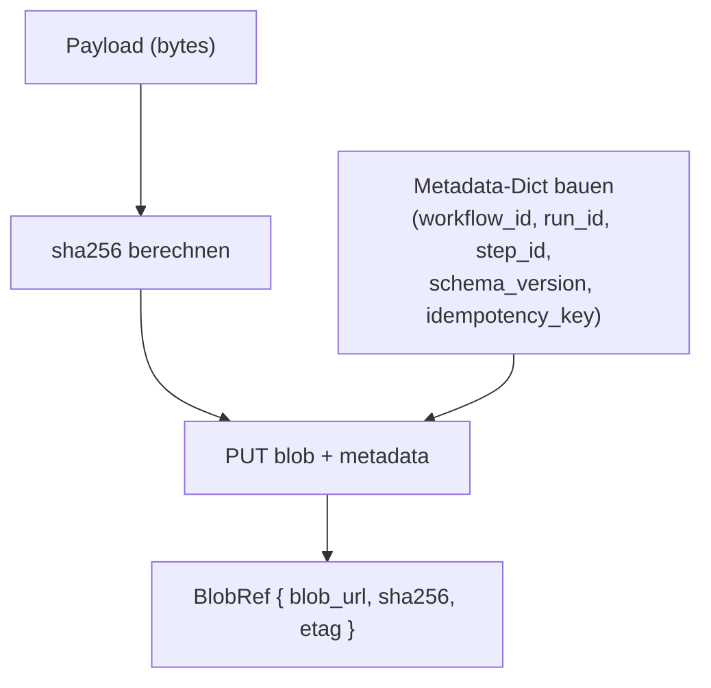

# Payload schreiben

> **Aufgabe.** Eine Nutzlast so in Blob Storage ablegen, dass Konsumenten
> sie integritätsgeprüft wiederfinden und Forensik möglich ist.

## Vertragsoberfläche

Was eine korrekte Schreib-Operation garantiert:

1. Das Blob ist vollständig geschrieben, bevor eine Referenz nach außen
   gegeben wird.
2. Die Referenz enthält `blob_url` und `sha256`; der Hash ist **vor** dem
   Upload berechnet.
3. Das Blob trägt die Storage-seitigen Korrelations-Metadaten.
4. Derselbe `blob_url` wird **nie überschrieben** (write-once).

## Ablauf



## Schritte

1. **Bytes vorbereiten.** Payload einmal serialisieren
   (JSON, Protobuf, …) und als `bytes` behalten. Nicht erneut
   serialisieren; die sha256-Berechnung muss über **denselben**
   Byte-Inhalt laufen wie der Upload.

2. **SHA-256 berechnen.** Hex-Digest, lowercase.

3. **Pfad bilden.** Konvention:
   `workflows/{business_tx_id}/{step_id}.json`. Das macht
   präfixbasiertes Listing pro Transaktion möglich und bindet den
   Blob-Namen an den logischen Schritt.

4. **Metadata-Dict bauen.**
   ```jsonc
   {
     "workflow_id":     "order-tx-789",
     "run_id":          "run-456",
     "step_id":         "reserve-inventory",
     "schema_version":  "1.0",
     "idempotency_key": "tx-789:reserve-inventory:1.0"
   }
   ```
   Details: [`guides/blob/blob-metadaten-stempeln.md`](blob-metadaten-stempeln.md).

5. **Upload.** Eine einzelne Operation, die Bytes und Metadata zusammen
   persistiert. Nach Erfolg: vom Backend gelieferter ETag, falls
   vorhanden.

6. **BlobRef bauen.**
   ```jsonc
   {
     "blob_url": "workflows/tx-789/reserve-inventory.json",
     "sha256":  "abc…",
     "etag":    "0x8da4f1c93b7e9f2a"   // falls geliefert, sonst ""
   }
   ```

## Atomarität

- Partial Writes sind unzulässig. Falls die Upload-Operation abbricht,
  muss der Fehler propagiert werden; das Workflow-Level behandelt das
  als transienten Fehler und retryt.
- Manche Storage Backends liefern unterschiedliche ETags für
  unterschiedliche Schreib-APIs. Der ETag ist ein **Hinweis**, kein
  Vertrag; die **verbindliche** Integritätszusage ist `sha256`.

## Content-Type

Default: `application/json`. Andere Inhalte (Binary, gzip) setzen den
`content_type` im Envelope **und** den Content-Type auf dem Blob. Konsumenten
deserialisieren anhand des Envelope-Werts.

## Häufige Fehler

- **SHA-256 nach Upload berechnen (auf der Download-Seite).** Sinnlos:
  wenn das Blob korrumpiert ankommt, fehlt der Abgleich.
- **Payload zweimal serialisieren.** Sobald ein Feld neu sortiert oder
  umformatiert wird, ändert sich der Hash; der Konsument verifiziert
  erfolglos.
- **Überschreiben bei Retry.** Retry darf denselben Content unter
  demselben Pfad schreiben (write-once mit idempotency) oder einen
  neuen Pfad wählen; ein inkonsistenter Overwrite mit anderem Inhalt
  bricht die Audit-Eigenschaft.
- **Metadata-Keys vergessen.** Spätere Forensik ist nur mit den fünf
  Korrelations-Attributen möglich.

## Siehe auch

- [Reference: Regeln](../../reference/regeln.md) (B-1 bis B-8)
- [Guide: Payload lesen und verifizieren](payload-lesen-und-verifizieren.md)
- [Guide: Blob-Metadaten stempeln](blob-metadaten-stempeln.md)
