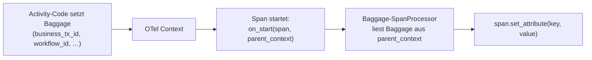

# Baggage zu Span-Attributen

> **Aufgabe.** Die sechs Business-Attribute über W3C Baggage so
> propagieren, dass jeder Span im Service (auch tief verschachtelte
> Library-Spans wie `blob.put`, `db.query`) sie automatisch als
> Attribut trägt, ohne dass der Fachcode sie explizit setzt.

## Problem

Wenn nur der **äußerste** Activity-Span `business_tx_id` trägt, sind
Jaeger-Queries der Form „alle Spans zu tx-789" unvollständig:
Child-Spans fehlen. Sie manuell zu stempeln ist invasiv und fehleranfällig.

## Idee

Baggage ist ein Kontext-Kanal, der automatisch mit der OTel-Context-
Propagation mitreist. Ein **Span Processor** hängt sich in den
Span-Lifecycle und liest Baggage beim `on_start`-Event. Alle
nicht-leeren Baggage-Werte landen als Span-Attribute.



## Welche Werte

Standard-Set (die sechs Business-Attribute):

- `business_tx_id`
- `workflow_id`
- `run_id`
- `step_id`
- `payload_ref_sha256`
- `schema_version`

## Schritte

1. **SpanProcessor schreiben** (sprachunabhängig):
   ```text
   class BaggageBusinessAttrSpanProcessor:
       KEYS = ["business_tx_id", "workflow_id", "run_id",
               "step_id", "payload_ref_sha256", "schema_version"]

       def on_start(self, span, parent_context):
           bag = baggage_from_context(parent_context)
           for k in self.KEYS:
               v = bag.get(k)
               if v is not None:
                   span.set_attribute(k, str(v))

       def on_end(self, span):    pass
       def shutdown(self):        pass
       def force_flush(self, t):  pass
   ```

2. **SpanProcessor registrieren** beim Aufbau des TracerProvider,
   **zusätzlich** zu den Export-Processoren.

3. **Baggage publizieren**, sobald der Envelope bekannt ist. Entweder:
   - Direkt im Activity-Einstieg (nach Extract des Envelope-Contexts),
     **bevor** der Activity-Body läuft.
   - Als Decorator oder Interceptor, der Envelope-Felder automatisch in
     Baggage setzt.

## Reihenfolge beachten!

Der Processor liest Baggage beim Span-**Start**. Wer Baggage erst
**innerhalb** eines Spans setzt, beobachtet keinen Effekt auf diesen
Span, nur auf dessen Kinder.

Korrekte Reihenfolge im Activity-Einstieg:

```text
ctx_with_baggage = set_baggage_items(envelope_values)
with tracer.start_as_current_span("activity.X", context=ctx_with_baggage):
    run_activity_body()
```

## Fallstricke

- **Leere Strings als Baggage.** `run_id = ""` im Ingress-Span ist
  normal (Temporal hat noch keine vergeben). Der Processor filtert
  **nur** `None`, nicht leere Strings. Ein `run_id = ""` landet
  bewusst als Span-Attribut; das macht die Abwesenheit des echten
  Werts explizit sichtbar, statt das Attribut ganz wegzulassen.
  Konsumenten der Telemetrie müssen mit `""` umgehen können.
- **PII in Baggage.** Baggage wird über Service-Grenzen transportiert
  und landet potenziell in Fremd-Backends. Nur die sechs
  Business-Attribute gehören hinein.
- **Baggage-Größe.** Baggage ist Header-gebunden. Viele Werte oder
  lange Strings blähen Requests auf. Sechs kurze IDs sind unkritisch.

## Häufige Fehler

- **Set im Fachcode.** Führt dazu, dass Library-Spans
  (`blob.put`, `db.query`) die Attribute nicht bekommen.
- **Processor nur auf `on_end` lauschen lassen.** Exporter haben den
  Span zu diesem Zeitpunkt evtl. schon geserialisiert. Auf `on_start`
  setzen.
- **Baggage über Service-Grenze vergessen.** Der Processor sieht dann
  nichts; Attribute fehlen. Propagation durch den Envelope ist
  Voraussetzung.

## Siehe auch

- [Reference: Korrelationsattribute](../../reference/korrelationsattribute.md)
- [Guide: Trace Context im Envelope](trace-kontext-im-envelope.md)
- [Guide: Workflow-Span-Attribute](workflow-span-attribute.md)
