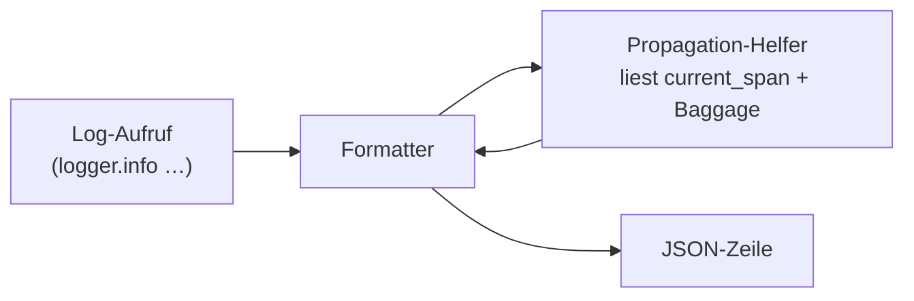

# Logs mit Traces korrelieren

> **Aufgabe.** Strukturierte Log-Einträge so schreiben, dass ein
> gefundener Log-Satz sowohl im Trace Backend (per `trace_id`) als auch
> per fachlicher ID (`business_tx_id`) in den richtigen Saga-Lauf
> zurückführt.

## Felder, die jedes Log-Event trägt

**Pflicht** (Regel O-3):

| Feld              | Quelle                                               |
| ----------------- | ---------------------------------------------------- |
| `timestamp`       | UTC, ISO 8601, Millisekundenauflösung                |
| `level`           | `DEBUG`, `INFO`, `WARNING`, `ERROR`                  |
| `message`         | menschenlesbare Nachricht, ohne PII                  |
| `service`         | Logischer Servicename (z. B. `payment`)              |
| `trace_id`        | aus aktivem Span                                     |
| `span_id`         | aus aktivem Span                                     |
| `business_tx_id`  | aus Baggage (oder explizit gesetzt)                  |

**Empfehlung** (zusätzliche Korrelation für fachliche Queries):

| Feld              | Quelle       |
| ----------------- | ------------ |
| `workflow_id`     | aus Baggage  |
| `run_id`          | aus Baggage  |
| `step_id`         | aus Baggage  |

Alle Felder snake_case, flach. Kein Verschachteln von Objekten, außer
explizitem `error = {type, message, stacktrace}`.

## Ablauf



## Schritte

1. **Formatter wählen.** Strukturiertes JSON; eine Zeile pro Event.
   Kein Mehrzeiliges (bricht viele Log-Parser).

2. **Trace- und Baggage-Werte injizieren.** Im Formatter oder per
   Log-Processor die aktuellen Werte aus dem OTel-Kontext holen und
   als Log-Felder anhängen, bevor die Zeile geschrieben wird.

3. **`message` sauber halten.** Keine Werte einmischen, die ohnehin
   als eigenes Feld vorhanden sind. `f"processed tx {business_tx_id}"`
   ist schlechter als `logger.info("processed tx")` mit
   `business_tx_id` im Log-Feld: so ist die Gruppierung nach ID in
   der Log-UI trivial.

4. **Errors.** `level=ERROR` plus ein `error`-Objekt:
   ```jsonc
   {
     "level": "ERROR",
     "message": "payment rejected",
     "error": {
       "type": "InsufficientFundsError",
       "message": "balance below threshold",
       "stacktrace": "…"
     },
     "business_tx_id": "tx-789",
     "trace_id": "abc…", "span_id": "def…"
   }
   ```

## Pseudocode: Injektion im Formatter

```text
def format(record):
    span    = current_span()
    bag     = current_baggage()
    return json.dumps({
        "timestamp":       record.timestamp,
        "level":           record.level,
        "message":         record.message,
        "service":         SERVICE_NAME,
        "trace_id":        span.trace_id if span else "",
        "span_id":         span.span_id  if span else "",
        "business_tx_id":  bag.get("business_tx_id", ""),
        "workflow_id":     bag.get("workflow_id",    ""),
        "run_id":          bag.get("run_id",         ""),
        "step_id":         bag.get("step_id",        ""),
        **record.extra,
    })
```

## Zwei Log-Backends, eine Korrelation

Typische Produktiv-Topologie: Logs fließen in ein Log Backend (Loki,
Elastic, Splunk), Traces in ein Trace Backend (Jaeger, Tempo). Dieselbe
`trace_id` in beiden ermöglicht den „Log zu Trace"-Drilldown der UIs.
`business_tx_id` erlaubt die fachliche Gegenrichtung: aus einem
Ticket mit fachlicher ID direkt in die zugehörigen Logs und Traces
springen.

## Häufige Fehler

- **PII im `message`.** Landet in allen Kanälen (Logs, Dashboards,
  Audit), ist schwer zu entfernen.
- **`trace_id` nur in manchen Events.** Sobald ein Pfad ohne aktiven
  Span läuft (z. B. ganz am Anfang im Ingress), fehlt die Korrelation.
  Dann: leerer String, nicht das Feld weglassen; so bleiben
  Log-Schemas konsistent.
- **Eigene `correlation_id` erfinden.** `business_tx_id` ist bereits
  der fachliche Korrelationskanal; ein paralleler Bezeichner
  verdoppelt Pflege und divergiert irgendwann.
- **Zu viele Log-Felder.** Logs mit >50 Feldern pro Zeile werden teuer
  und schwer lesbar. Ein fokussierter Kernsatz reicht.

## Siehe auch

- [Reference: Regeln](../../reference/regeln.md) (O-3)
- [Reference: Korrelationsattribute](../../reference/korrelationsattribute.md)
- [Guide: Baggage zu Span-Attributen](baggage-zu-span-attributen.md)
