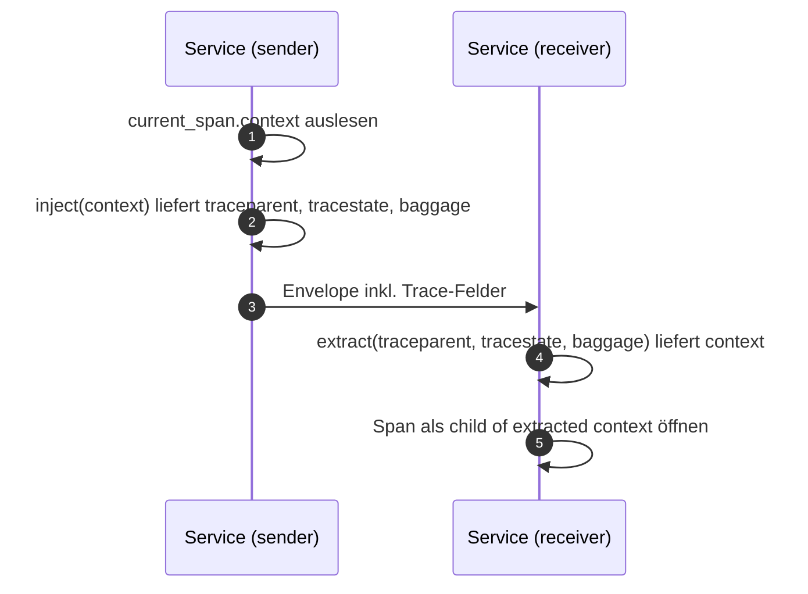

# Trace Context im Envelope

> **Aufgabe.** W3C Trace Context und Baggage an jeder Service-Grenze
> so weiterreichen, dass die entstehende Span-Hierarchie genau der
> fachlichen Saga-Struktur entspricht.

Der Envelope ist der **einzige** Transporteur für Trace Context
zwischen Services. Keine HTTP-Header, keine Message-Attribute, keine
Queue-Felder. Dadurch gelten dieselben Propagationsregeln, egal ob
Activities über HTTP, gRPC oder Temporal-interne Transporte laufen.

## Die drei Felder

| Feld         | Inhalt                                                                        |
| ------------ | ----------------------------------------------------------------------------- |
| `traceparent`| W3C-Format: `00-<trace-id>-<parent-span-id>-<flags>`                          |
| `tracestate` | W3C-Format: `vendor1=value1,vendor2=value2`; Default leer                     |
| `baggage`    | Map; Minimum `correlation.id = business_tx_id`                                |

## Ablauf



## Inject (sender)

1. Aktive Trace Context aus dem laufenden Span holen.
2. W3C-Propagator anweisen, Trace Context in eine String-Map zu
   injizieren.
3. Werte aus der Map in die entsprechenden Envelope-Felder
   übernehmen.

**Pseudocode:**
```text
carrier = {}
w3c_propagator.inject(carrier, current_context)
envelope.traceparent = carrier["traceparent"]
envelope.tracestate  = carrier.get("tracestate", "")
envelope.baggage     = extract_baggage(current_context)
```

## Extract (receiver)

1. Envelope-Felder in eine String-Map legen.
2. Propagator den Context aus der Map rekonstruieren lassen.
3. Den rekonstruierten Context als **Eltern-Context** verwenden, wenn
   der neue Span geöffnet wird.

**Pseudocode:**
```text
carrier = {
    "traceparent": envelope.traceparent,
    "tracestate": envelope.tracestate,
    "baggage":     serialize_baggage(envelope.baggage),
}
parent_context = w3c_propagator.extract(carrier)
with tracer.start_as_current_span("activity.reserve-inventory",
                                   context=parent_context) as span:
    ...
```

## Wo der Trace Context zuerst entsteht

- Im Entry Service, beim Empfang des externen Requests. Der HTTP-Server
  öffnet den Root-Span; alle folgenden Spans hängen darunter.
- Bei Event-driven Entry: der Event-Consumer öffnet den Root-Span, so
  früh wie möglich, bevor `business_tx_id` generiert wird.

## Temporal-Besonderheiten

- **Activity-Spans** sind **nicht** automatisch Kinder des Workflow-Spans, es sei denn, der Envelope trägt den Context und der Worker extrahiert ihn. Genau das ist der Sinn der drei Envelope-Felder.
- **Retries** öffnen pro Attempt einen eigenen Span. Alle Attempts
  hängen am selben Parent (dem Workflow-Span), sind also Geschwister,
  nicht verschachtelt.

## Häufige Fehler

- **`traceparent` leer lassen und darauf hoffen, dass der
  Temporal-OTel-Contrib es schon regelt.** In heterogenen Setups (Mix
  aus Python, Go, TypeScript) ist der Envelope der einzig zuverlässige
  Kanal.
- **Baggage vergessen.** Ergebnis: `business_tx_id` ist im ersten Span
  vorhanden, in Child-Spans (`blob.put`, `db.write`) nicht.
- **Propagator-Format uneinheitlich.** B3 und W3C sind inkompatibel;
  alle Services müssen denselben Standard verwenden. Im Zweifel:
  **W3C**.
- **Trace Context erst nach `StartWorkflow` setzen.** Der Ingress-Span
  hängt in einem anderen Trace; `business_tx_id`-Query liefert Lücken.

## Siehe auch

- [Reference: Envelope-Felder](../../reference/envelope-felder.md)
- [Guide: Baggage zu Span-Attributen](baggage-zu-span-attributen.md)
- [Guide: Workflow-Span-Attribute](workflow-span-attribute.md)
- [W3C Trace Context](https://www.w3.org/TR/trace-context/)
- [W3C Baggage](https://www.w3.org/TR/baggage/)
