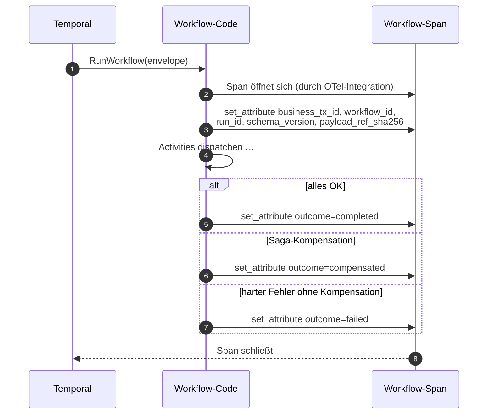

# Workflow-Span-Attribute

> **Aufgabe.** Auf dem Top-Level-Workflow-Span (dem Elternteil aller
> Activity-Spans) die Geschäfts-Identität so anbringen, dass Workflow-
> Queries ohne Umwege über Child-Spans funktionieren.

## Warum nicht nur Activity-Spans reichen

Activity-Spans tragen bereits `business_tx_id`, `workflow_id`, `run_id`,
`step_id`. Trace-Suchen „zeig alle Workflows eines Kunden" starten aber
am Workflow-Span, der bei naiver Integration oft nur mit
`temporal.workflow.type` beschriftet ist. Ohne Geschäftsattribute am
Workflow-Span muss der Operator zuerst einen Activity-Span finden, um
zum Workflow zu navigieren.

## Attribute

Auf dem Workflow-Span erwartet:

| Attribut                | Wert                                                       |
| ----------------------- | ---------------------------------------------------------- |
| `business_tx_id`        | fachliche Korrelations-ID                                  |
| `workflow_id`           | deterministische Workflow-ID                               |
| `run_id`                | Temporal-Run-ID                                            |
| `schema_version`        | Envelope-Schema-Version                                    |
| `payload_ref_sha256`    | SHA-256 des Ingress-Payloads                               |
| `outcome`               | `completed`, `compensated`, `failed`                       |

`step_id` fehlt absichtlich: ein Workflow hat **keine** einzelne
`step_id`, sondern dispatcht viele.

## Ablauf

## Schritte

1. **Sobald der Envelope im Workflow-Body gelesen wurde**, die fünf
   Identity-Attribute auf den Workflow-Span setzen. Das ist der
   früheste Zeitpunkt, an dem sie bekannt sind.

2. **`outcome` setzen, kurz bevor der Workflow terminiert.** Drei Fälle:
   - Alle Vorwärtsschritte erfolgreich: `completed`.
   - Vorwärtsschritt gescheitert, Kompensation gelaufen (auch partiell):
     `compensated`.
   - Harter Fehler ohne Kompensation (ungewöhnlich, z. B.
     Worker-Versagen vor dem ersten Schritt): `failed`.

3. **Errorpfad**: zusätzlich Span-Status `ERROR` und ein
   `exception`-Span-Event mit `error.type` und `error.message`.

## Temporal-spezifische Feinheiten

- In einigen SDKs ist der „Workflow-Span" nicht der Span des
  Workflow-**Starts**, sondern der Span des einzelnen
  `RunWorkflow`-Durchlaufs (Retry-relevant). Das ist der richtige
  Span für `outcome`, weil ein ContinueAsNew einen neuen Workflow-Span
  öffnet.
- Im Workflow-Body gibt es typischerweise keinen gültigen
  „aktuellen Span" über die normale Tracer-API; die OTel-Integration
  des Temporal-SDKs reicht einen dedizierten Span-Handle. Siehe
  [`guides-python/otel-python-instrumentierung.md`](../../guides-python/otel-python-instrumentierung.md)
  für das Python-Muster.

## Häufige Fehler

- **Attribute nur auf Activity-Spans.** Workflow-Queries im Tracing-UI
  brauchen Umwege.
- **`outcome` früh setzen und nie überschreiben.** Kompensation
  läuft nach dem ursprünglichen Fehler; `outcome` muss ganz am Ende
  gesetzt werden.
- **Status `OK` bei Kompensation.** `compensated` ist **kein** Happy
  Path. Span-Status `ERROR` setzen; `outcome=compensated` beschreibt
  nur die Art des Scheiterns.
- **Attribute aus dem ersten Activity-Span holen** statt aus dem
  Envelope. Redundant und fehleranfällig bei Refactors.

## Siehe auch

- [Reference: Regeln](../../reference/regeln.md) (O-2, O-4)
- [Guide: Baggage zu Span-Attributen](baggage-zu-span-attributen.md)
- [Guide: Kompensation verdrahten](../temporal/kompensation-verdrahten.md)
