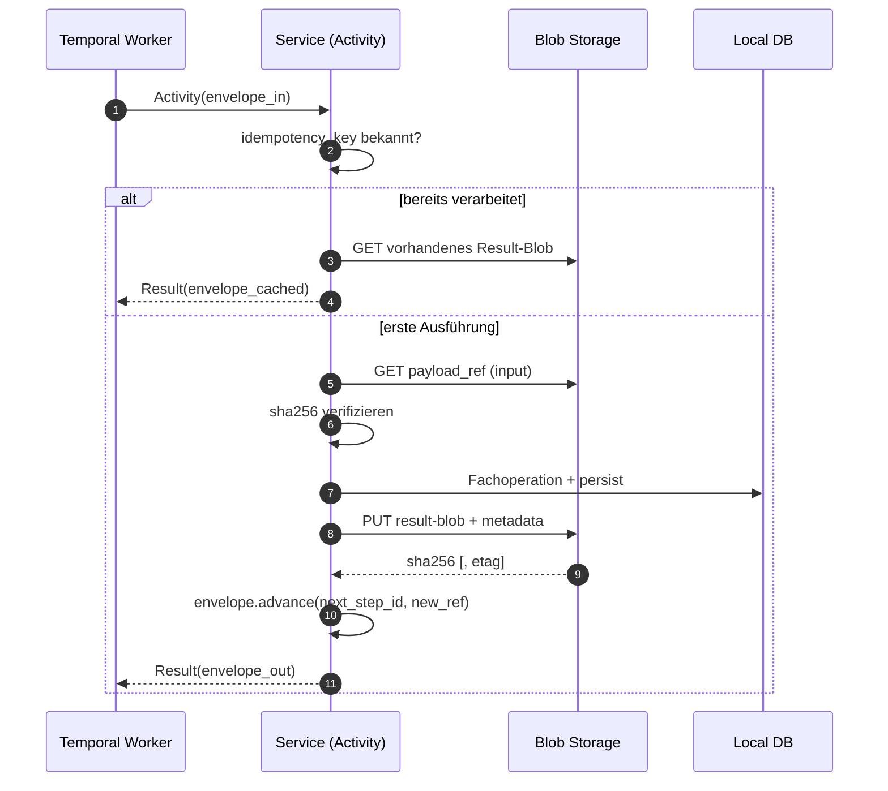

# Activity mit Envelope implementieren

> **Aufgabe.** Eine Saga-Activity so implementieren, dass sie den Envelope
> als Eingang nimmt, Payload aus Blob Storage lädt, eine fachliche
> Operation idempotent durchführt, das Ergebnis als neues Blob persistiert
> und einen fortgeschriebenen Envelope zurückgibt.

Voraussetzungen: Worker läuft auf eigener Task Queue, Temporal Client
und Blob Client sind initialisiert, Tracer ist aktiv.

## Ablauf



## Schritte

1. **Idempotenz prüfen.** `idempotency_key` gegen den lokalen
   Operations-Log (z. B. eine `processed_steps`-Tabelle) prüfen. Treffer:
   das zuvor geschriebene Result-Blob referenzieren und zurückgeben, ohne
   die Fachoperation erneut auszuführen.

2. **Payload laden und verifizieren.**
   ```text
   bytes = blob.get(envelope.payload_ref.blob_url)
   assert sha256(bytes) == envelope.payload_ref.sha256
   payload = deserialize(bytes, envelope.content_type)
   ```
   Mismatch ist ein non-retryable Fehler (Datenintegrität verletzt).

3. **Fachoperation ausführen.** Genau **eine** Operation pro Activity.
   Innerhalb derselben DB-Transaktion: Fachmutation und ein
   `INSERT` in den Operations-Log mit `idempotency_key`. So ist die
   Activity auch bei Worker-Crash zwischen Mutation und Result-Rückgabe
   idempotent.

4. **Result-Blob schreiben.**
   Pfad: `workflows/{business_tx_id}/{step_id}-result.json`. Metadata:
   `workflow_id`, `run_id`, `step_id`, `schema_version`,
   `idempotency_key`. Details: [`guides/blob/payload-schreiben.md`](../blob/payload-schreiben.md).

5. **Envelope fortschreiben.**
   `advance(next_step_id, new_payload_ref)` liefert den neuen Envelope.
   Garantien:
   - `parent_step_id` erhält den alten `step_id`.
   - `idempotency_key` wird neu gerechnet.
   - `business_tx_id`, `workflow_id`, `run_id`, `schema_version`,
     `traceparent`, `tracestate`, `baggage` bleiben unverändert.

6. **Rückgabe.** Nur den neuen Envelope. **Nie** die persistierten
   Fachdaten; die liegen im Blob.

## Minimal-JSON

**Eingang:**
```jsonc
{
  "step_id": "reserve-inventory",
  "payload_ref": { "blob_url": "workflows/tx-789/input.json", "sha256": "abc…" },
  "idempotency_key": "tx-789:reserve-inventory:1.0",
  // weitere Felder siehe Envelope-Referenz
}
```

**Rückgabe:**
```jsonc
{
  "parent_step_id": "reserve-inventory",
  "step_id": "charge-payment",
  "payload_ref": { "blob_url": "workflows/tx-789/reserve-inventory-result.json", "sha256": "def…" },
  "idempotency_key": "tx-789:charge-payment:1.0",
  // unverändert: workflow_id, run_id, business_tx_id, schema_version, traceparent, tracestate, baggage
}
```

## Fehlerbehandlung

- **Transiente Fehler** (Storage-Timeout, Netzwerk, 5xx upstream):
  **real** werfen. Temporal retryt laut Retry Policy.
- **Fachliche Fehler** (`InsufficientFunds`, `OutOfStock`):
  eigenen, in `non_retryable_error_types` aufgeführten Typ werfen.
- **Integritätsfehler** (`sha256` mismatch, Schema ungültig):
  non-retryable werfen; das ist kein transientes Problem.

## Häufige Fehler

- Mehrere Fachoperationen pro Activity: verletzt T-1 der
  [Regeln](../../reference/regeln.md) (genaue Zuordnung eines
  Seiteneffekts zu einem Schritt).
- Idempotenz-Check **nach** der Fachmutation: Doppel-Seiteneffekte bei
  Retry.
- Rohdaten im Activity-Result statt Blob-Referenz: Event History
  schwillt an, Auditierbarkeit leidet.
- `sha256`-Verifikation vergessen: stille Datenkorruption möglich.

## Siehe auch

- [`reference/envelope-felder.md`](../../reference/envelope-felder.md)
- [`reference/regeln.md`](../../reference/regeln.md)
- [`guides/blob/payload-lesen-und-verifizieren.md`](../blob/payload-lesen-und-verifizieren.md)
- [`guides/blob/payload-schreiben.md`](../blob/payload-schreiben.md)
