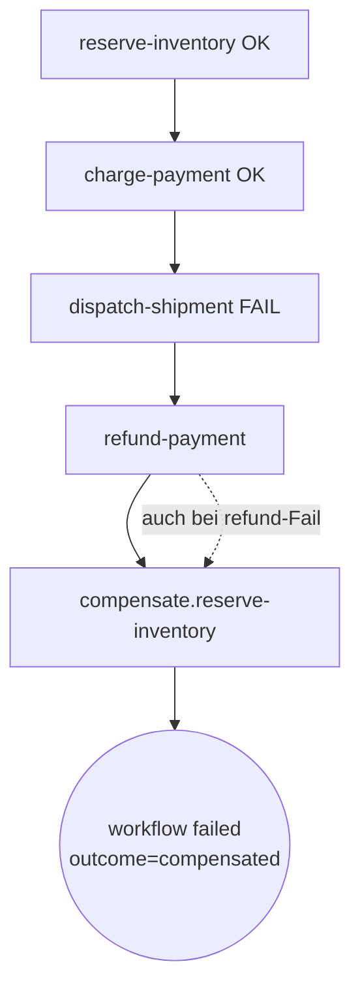
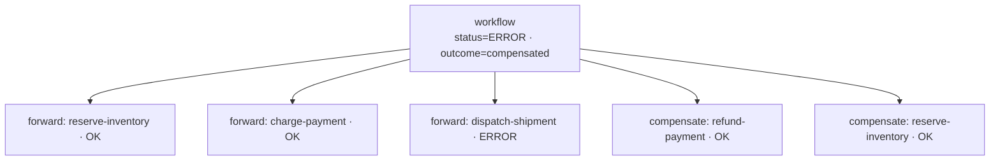

# Kompensation verdrahten

> **Aufgabe.** Saga-Kompensation so aufbauen, dass bei Fehlschlag eines
> Vorwärtsschritts alle bis dahin ausgeführten Schritte rückwärts und
> **unabhängig voneinander** kompensiert werden, auch wenn einzelne
> Kompensationen selbst scheitern.

Voraussetzungen: Activities sind idempotent, pro Vorwärtsschritt existiert
eine Kompensations-Activity mit `compensate.`-Präfix im `step_id`.

## Kernidee

Kompensation ist **kein** rückwärts laufender Retry. Kompensation ist eine
eigene Folge von idempotenten Undo-Operationen, die jeweils den **Effekt**
des Vorwärtsschritts rückgängig machen (Reservierung freigeben, Refund
auslösen, Versandauftrag stornieren).

Kritische Regel: Schlägt eine Kompensation fehl, werden die übrigen
**trotzdem** ausgeführt. Ein teilweiser Cleanup ist besser als gar keiner.

## Ablauf



## Schritte

1. **Pro Vorwärtsschritt eine Kompensation definieren.** Namenskonvention:
   `compensate.<forward-step-id>`. Gleiche Task Queue wie der
   Vorwärtsschritt (dasselbe Service besitzt den Zustand).

2. **Fortschritt tracken.** Der Workflow weiß zu jedem Zeitpunkt, welche
   Vorwärtsschritte erfolgreich waren. Implementierung: lokale Variablen
   im Workflow-Code (`inventory_reserved = True` nach erfolgreicher
   Activity).

3. **Kompensation bei Fehler auslösen.** Der Workflow fängt den Fehler
   des letzten Vorwärtsschritts, prüft die Fortschrittsflags und ruft
   für jeden erfolgreichen Vorwärtsschritt die zugehörige
   Kompensation auf.

4. **Jede Kompensation isoliert `try/catch`-en.**
   ```text
   caught_errors = []

   if payment_charged:
       try:
           execute_activity("refund-payment", envelope.advance(...))
       except Exception as e:
           caught_errors.append(e)

   if inventory_reserved:
       try:
           execute_activity("compensate.reserve-inventory", envelope.advance(...))
       except Exception as e:
           caught_errors.append(e)

   raise original_error from (caught_errors[-1] if caught_errors else None)
   ```
   Ohne Isolation stoppt die Kette beim ersten Fehler. Das hinterlässt
   schwebende Reservierungen oder nicht zurückerstattete Zahlungen.

5. **Workflow als failed markieren.** Nach Kompensation wird der
   ursprüngliche Fehler propagiert (oder ein zusammengesetzter, falls
   Kompensationen selbst fehlschlugen). Der Workflow-Status ist
   `FAILED`; auf Span-Ebene `status=ERROR` mit
   `outcome=compensated`.

## Span-Bild

Alle Kompensations-Spans hängen am Workflow-Span, nicht am fehlgeschlagenen
Vorwärtsschritt. Das hält die Trace-Struktur flach und gut filterbar.



## Häufige Fehler

- **Kompensationen sequenziell ohne `try/catch`.** Scheitert der erste
  Undo, bleiben alle späteren aus. Ergebnis: leakende Reservierungen,
  inkonsistente Zustände.
- **Kompensation nicht idempotent.** Temporal retryt auch
  Kompensations-Activities. Ohne Idempotenz-Check droht doppelter Refund.
- **`raise X from None` weggelassen und stattdessen
  `raise` aus dem `except`-Block**: erzeugt vermischte Cause-Ketten, die
  die Ursache verschleiern. Beim bewussten Verwerfen der
  Python-Context-Kette `from None` verwenden; die Temporal-Cause-Kette
  bleibt separat erhalten.
- **Forward-Flags vor Activity-Ergebnis setzen.** Führt dazu, dass eine
  nie erfolgreich ausgeführte Vorwärtsaktion kompensiert wird.

## Test-Stellvertreter

- **Happy Path:** alle Vorwärtsschritte erfolgreich, keine
  Kompensation.
- **Single Failure:** letzter Vorwärtsschritt schlägt fehl, alle
  vorigen werden kompensiert.
- **Double Failure:** Vorwärtsschritt und eine Kompensation schlagen
  fehl; die anderen Kompensationen laufen trotzdem; der Workflow ist
  `FAILED`.

## Siehe auch

- [Reference: Fehlertaxonomie](../../reference/fehlertaxonomie.md)
- [Reference: Regeln](../../reference/regeln.md) (T-4)
- [Guide: Retry Policy wählen](retry-policy-waehlen.md)
