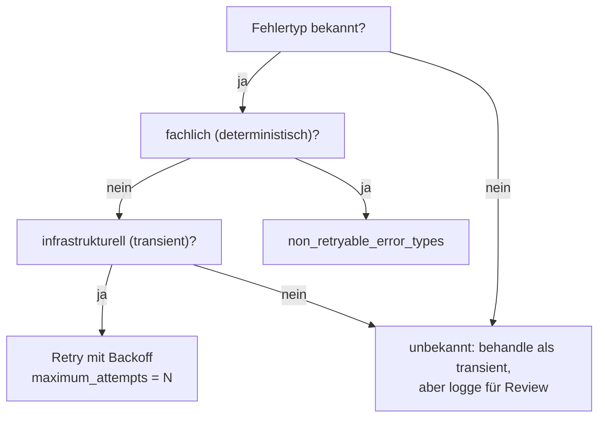

# Retry Policy wählen

> **Aufgabe.** Für jede Activity eine Retry Policy so konfigurieren, dass
> transiente Fehler robust überbrückt werden, fachliche Fehler sofort
> zur Kompensation führen und das System nicht unbegrenzt retryt.

## Die Stellschrauben

| Parameter               | Was er tut                                                                   |
| ----------------------- | ---------------------------------------------------------------------------- |
| `initial_interval`      | Wartezeit vor dem ersten Retry.                                              |
| `backoff_coefficient`   | Multiplikator pro Retry. Übliches Muster: `2.0` (exponentiell).              |
| `maximum_interval`      | Obergrenze für den Backoff.                                                  |
| `maximum_attempts`      | Gesamtzahl Versuche, inklusive dem ersten. `0` = unbegrenzt (**vermeiden**). |
| `non_retryable_error_types` | Liste von Fehlerklassennamen, bei denen **sofort** kein Retry erfolgt.  |

Zusätzlich pro Activity:

- `start_to_close_timeout`: maximale Dauer **einer** Ausführung.
- `schedule_to_close_timeout`: maximale Gesamtdauer inkl. aller Retries.

## Entscheidungs-Ablauf



## Empfohlene Defaults

Tauglich als Ausgangspunkt; feinjustieren pro Upstream-Charakteristik.

| Szenario                         | `initial_interval` | `backoff_coefficient` | `maximum_interval` | `maximum_attempts` |
| -------------------------------- | ------------------ | --------------------- | ------------------ | ------------------ |
| API-Aufruf mit schnellem Upstream| `250ms`            | `2.0`                 | `10s`              | `5`                |
| Payment Gateway                  | `2s`               | `2.0`                 | `30s`              | `3`                |
| Langsamer Batch-Upstream         | `5s`               | `2.0`                 | `2min`             | `4`                |
| Kompensations-Activity           | `1s`               | `2.0`                 | `30s`              | `5`                |

## `non_retryable_error_types` belegen

Hier stehen **deterministische Geschäftsfehler**, bei denen Wiederholung
garantiert denselben Fehler liefert:

- `InsufficientFundsError`
- `OutOfStockError`
- `ValidationError`
- `SchemaVersionMismatchError`

**Nicht** hineingehören:

- `TimeoutError`, `ConnectionError`, `GatewayTimeoutError` (transient).
- Generische `Exception` (macht jeden unerwarteten Fehler non-retryable;
  maskiert Bugs).

## Timeouts abstimmen

Faustregeln:

- `start_to_close_timeout` ≈ 2–3x erwartete P99-Dauer der Operation.
- `schedule_to_close_timeout` ≈
  `maximum_attempts * maximum_interval * 1.2` plus Sicherheitsreserve.
- `heartbeat_timeout` setzen, wenn die Activity länger als
  ~10s braucht; sonst merkt Temporal Worker-Crashes spät.

## Beispiel-Konfiguration (pseudocode)

```text
retry_policy = RetryPolicy(
    initial_interval       = 2s,
    backoff_coefficient    = 2.0,
    maximum_interval       = 30s,
    maximum_attempts       = 3,
    non_retryable_error_types = ["InsufficientFundsError"],
)

execute_activity(
    "charge-payment",
    envelope,
    start_to_close_timeout    = 15s,
    schedule_to_close_timeout = 2min,
    retry_policy              = retry_policy,
)
```

## Häufige Fehler

- **`maximum_attempts = 0`** (= unbegrenzt). Fehlschlag eskaliert nie
  zur Kompensation; der Workflow hängt.
- **`start_to_close_timeout` fehlt.** Default ist oft lang; ein hängender
  Upstream blockiert die Task Queue.
- **Transiente Fehler in `non_retryable_error_types`.** Verhindert die
  natürliche Selbstheilung.
- **Fachliche Fehler als `Exception`.** Landen ohne eigene Klasse nicht
  in `non_retryable_error_types` und werden retryt.

## Siehe auch

- [Reference: Fehlertaxonomie](../../reference/fehlertaxonomie.md)
- [Reference: Regeln](../../reference/regeln.md) (T-5, T-6, T-7)
- [Guide: Activity implementieren](aktivitaet-implementieren.md)
