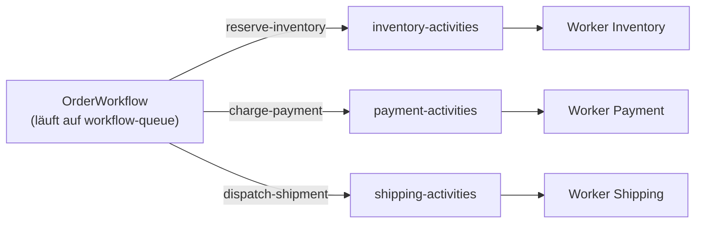

# Task Queue pro Service

> **Aufgabe.** Jede Activity läuft auf einer Task Queue, die zu **genau
> einem** Service gehört. So laufen Activities garantiert auf dem Worker
> mit dem passenden Fachstatus und den passenden Credentials.

## Warum

Temporal verteilt Activity Tasks über Task Queues. Wer auf einer Queue
lauscht, entscheidet, welche Activities er akzeptiert. Ohne Trennung
kann eine `charge-payment` auf einem Worker landen, der keine
Payment-DB-Verbindung hat: Fehlschlag zur Laufzeit.

Pro-Service-Queues:

- **Isolieren Fehldeployments.** Ein kaputter Payment-Worker blockiert
  nicht die Inventory-Activities.
- **Vereinfachen Scaling.** Jede Queue skaliert unabhängig mit der
  Load-Charakteristik ihres Services.
- **Machen Routing explizit.** Welche Activity gehört zu welchem
  Service, steht im Code des Workflows, nicht in Worker-Konfiguration.

## Namenskonvention

`{service}-activities`, z. B.

- `service-a-activities`
- `inventory-activities`
- `payment-activities`
- `shipping-activities`

Einheitlich in kebab-case. Services und Workflows nutzen dieselbe
Konstante.

## Service-A-Spezifika

Der Entry Service startet den Workflow und betreibt selbst eine Queue
für seine Start-Activity (z. B. Request-Validierung, `business_tx_id`
generieren, Blob schreiben). Konvention: dieselbe Queue wird als
**Workflow Task Queue** verwendet. Der Workflow-Code dispatcht dann
weiter auf `inventory-activities`, `payment-activities`,
`shipping-activities`.

## Worker-Setup (pseudocode)

```text
# Worker pro Service: registriert nur seine eigenen Activities
worker = Worker(
    client,
    task_queue = "payment-activities",
    activities = [charge_payment, refund_payment],
)
worker.run()
```

## Dispatch im Workflow (pseudocode)

```text
# im OrderWorkflow
env1 = execute_activity("reserve-inventory",
                        envelope,
                        task_queue = "inventory-activities",
                        ...)

env2 = execute_activity("charge-payment",
                        env1,
                        task_queue = "payment-activities",
                        ...)

env3 = execute_activity("dispatch-shipment",
                        env2,
                        task_queue = "shipping-activities",
                        ...)
```

## Ablauf



## Häufige Fehler

- **Alle Activities auf einer Queue.** Ein langsamer Service blockiert
  die Worker-Slots der anderen; Fehldeployments breiten sich aus.
- **Queue-Name als Magic String.** Über Services verteilte Tippfehler.
  Besser: geteilte Konstante in einem `shared`-Modul.
- **Worker registriert Activities anderer Services.** Aus Versehen
  übernimmt er Tasks, für die ihm die Fachanbindung fehlt.
- **Workflow-Queue ist eine Activity-Queue.** Entkoppelt nicht sauber;
  der Workflow Worker sollte separat laufen.

## Siehe auch

- [Reference: Regeln](../../reference/regeln.md) (T-3)
- [Guide: Workflow mit Envelope starten](workflow-mit-envelope-starten.md)
- [Guide: Activity implementieren](aktivitaet-implementieren.md)
