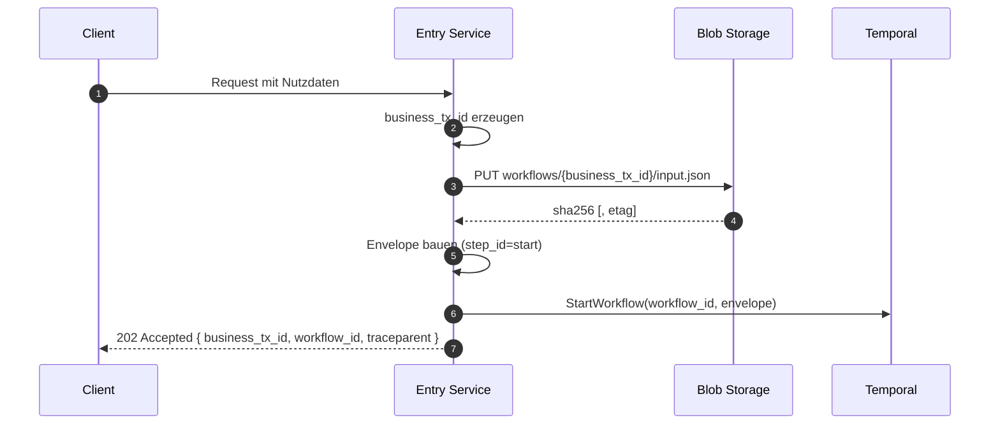

# Workflow mit Envelope starten

> **Aufgabe.** Einen Temporal Workflow aus einem Entry Service heraus so
> starten, dass ab Schritt 1 ein korrekt ausgefüllter Envelope mit
> Claim-Check-Referenz und W3C Trace Context zur Verfügung steht.

Voraussetzungen: verbundener Temporal Client, zugängliches Blob Storage,
aktiver Tracer. Felddefinitionen siehe
[`reference/envelope-felder.md`](../../reference/envelope-felder.md),
Invarianten siehe [`reference/regeln.md`](../../reference/regeln.md).

## Wann diese Seite gilt

- Der Workflow wird von einem **Entry Service** (Service A) gestartet, der
  einen externen Request entgegennimmt.
- Die Nutzdaten werden **vor** `StartWorkflow` in Blob Storage geschrieben.
- Der Aufrufer erhält `202 Accepted`; der Endzustand wird entkoppelt
  ausgeliefert.

## Ablauf



## Schritte

1. **Korrelations-IDs erzeugen.**
   - `business_tx_id`: stabile fachliche ID (UUID oder abgeleitet aus dem
     Fachschlüssel).
   - `workflow_id`: deterministisch aus dem Fachkontext (z. B.
     `order-{business_tx_id}`). Niemals zufällig; sonst kollidieren Retries
     des Ingress.
   - `run_id` beim Start **leer lassen**. Temporal vergibt sie und liefert
     sie im Start-Handle zurück. Für nachgelagerte Blob-Writes gilt sie als
     bekannt; für das **Ingress-Blob** bleibt sie leer (Blob wird vor
     `StartWorkflow` geschrieben).

2. **Payload schreiben.**
   Pfad nach Konvention: `workflows/{business_tx_id}/input.json`. SHA-256
   über den Byte-Inhalt berechnen, **bevor** hochgeladen wird. Details:
   [`guides/blob/payload-schreiben.md`](../blob/payload-schreiben.md).

3. **Trace Context injizieren.**
   Aktiven Span öffnen (z. B. `http.ingress`). `traceparent` und
   `tracestate` per W3C-Propagator in den Envelope schreiben. `baggage`
   enthält mindestens `correlation.id = business_tx_id`. Details:
   [`guides/otel/trace-kontext-im-envelope.md`](../otel/trace-kontext-im-envelope.md).

4. **Envelope bauen.**
   ```jsonc
   {
     "workflow_id": "order-tx-789",
     "run_id": "",
     "business_tx_id": "tx-789",
     "parent_step_id": null,
     "step_id": "start",
     "payload_ref": {
       "blob_url": "workflows/tx-789/input.json",
       "sha256": "…",
       "etag": ""
     },
     "traceparent": "00-<trace-id>-<span-id>-01",
     "tracestate": "",
     "baggage": { "correlation.id": "tx-789" },
     "schema_version": "1.0",
     "content_type": "application/json",
     "idempotency_key": "tx-789:start:1.0"
   }
   ```

5. **Workflow starten.**
   ```text
   handle = temporal.start_workflow(
       workflow_type = "OrderWorkflow",
       workflow_id  = envelope.workflow_id,
       task_queue   = "<service-a-task-queue>",
       args         = [envelope],
   )
   ```
   **Nicht** auf `handle.result()` warten. Das blockiert den HTTP-Request.

6. **Antwort an den Aufrufer.** `202 Accepted` mit
   `{ business_tx_id, workflow_id, traceparent }`. Der Client nutzt diese
   Felder, um den Endzustand über einen Status-Endpunkt, Webhook oder
   Event-Stream abzuholen.

## Was dieser Ablauf garantiert

- **Jeder nachgelagerte Schritt** erbt Korrelations-IDs und Trace Context
  ohne weitere Propagationslogik. Der Envelope ist der Vertrag.
- **Retries sind sicher.** `workflow_id` ist deterministisch: ein erneuter
  Start mit identischem Fachkontext erzeugt keinen Doppel-Workflow,
  sondern trifft auf einen bestehenden (abhängig von der gewählten
  `WorkflowIDReusePolicy`).
- **Der Ingress ist zustandslos.** Nach `StartWorkflow` gibt es keinen
  serverseitigen Wartezustand im HTTP-Request.

## Häufige Fehler

- `workflow_id` zufällig wählen: Ingress-Retries erzeugen Doppel-Workflows.
- Payload **nach** `StartWorkflow` schreiben: der erste Activity-Schritt
  sieht kein Blob und scheitert am Claim-Check.
- `traceparent` erst in Schritt 1 setzen: der Ingress-Span hängt in einem
  anderen Trace als der Workflow; `business_tx_id`-Query liefert Lücken.
- `idempotency_key` frei vergeben statt nach Formel
  `business_tx_id:step_id:schema_version`: Kollisionen bei Retry werden
  zur Laufzeitdiagnose verschoben.

## Siehe auch

- [`reference/envelope-felder.md`](../../reference/envelope-felder.md)
- [`reference/regeln.md`](../../reference/regeln.md)
- [`guides/temporal/aktivitaet-implementieren.md`](aktivitaet-implementieren.md)
- [`guides/otel/trace-kontext-im-envelope.md`](../otel/trace-kontext-im-envelope.md)
