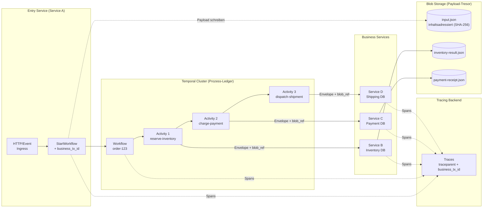
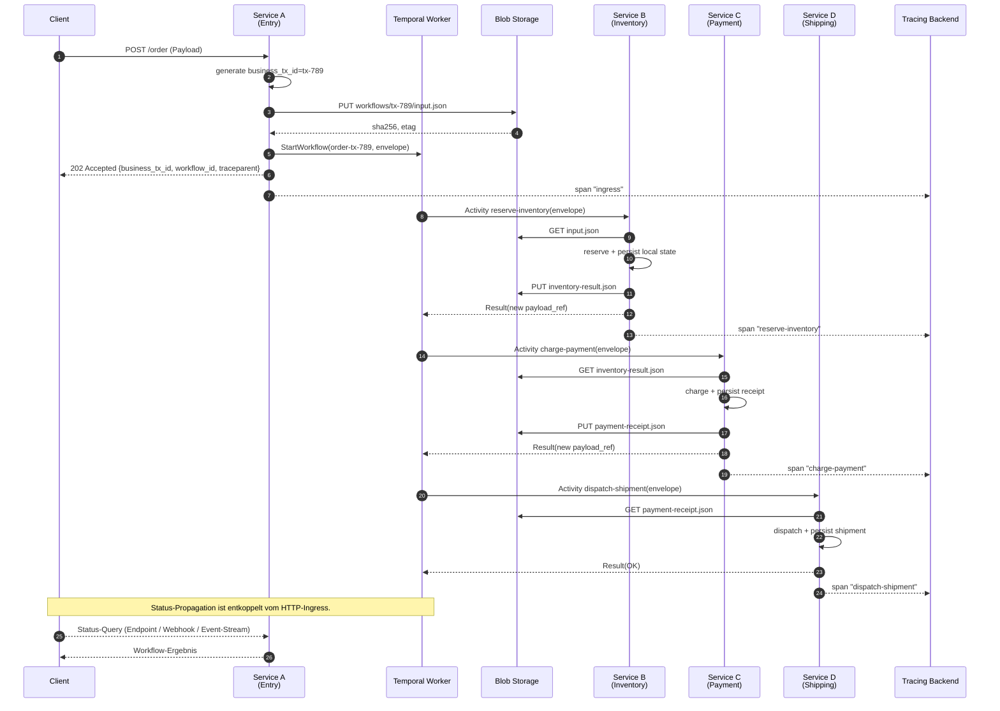
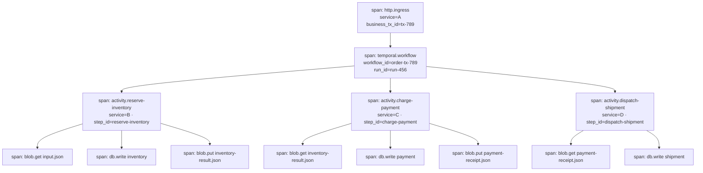
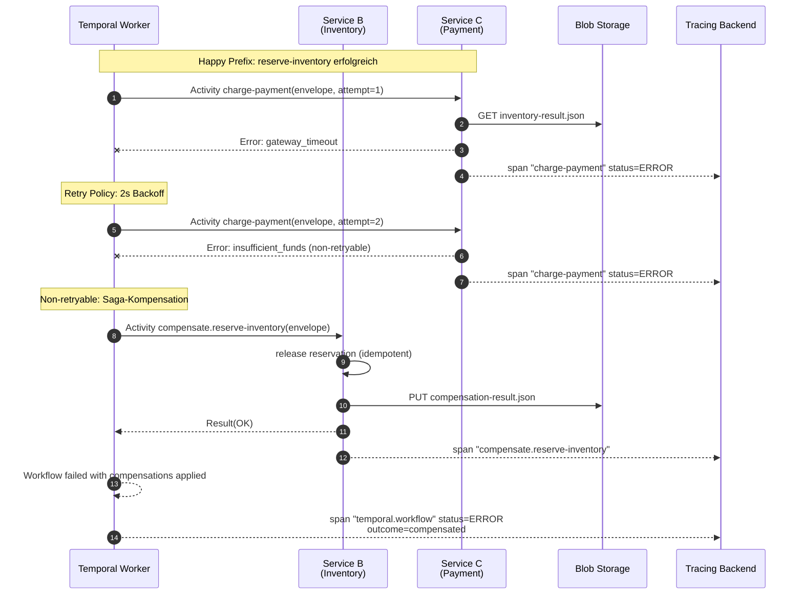
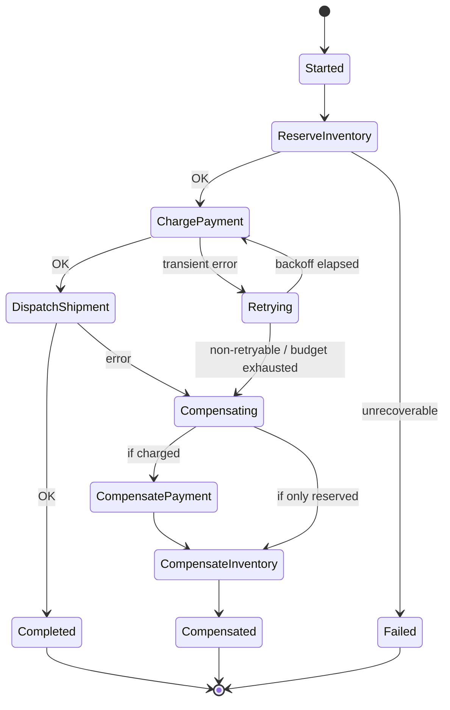
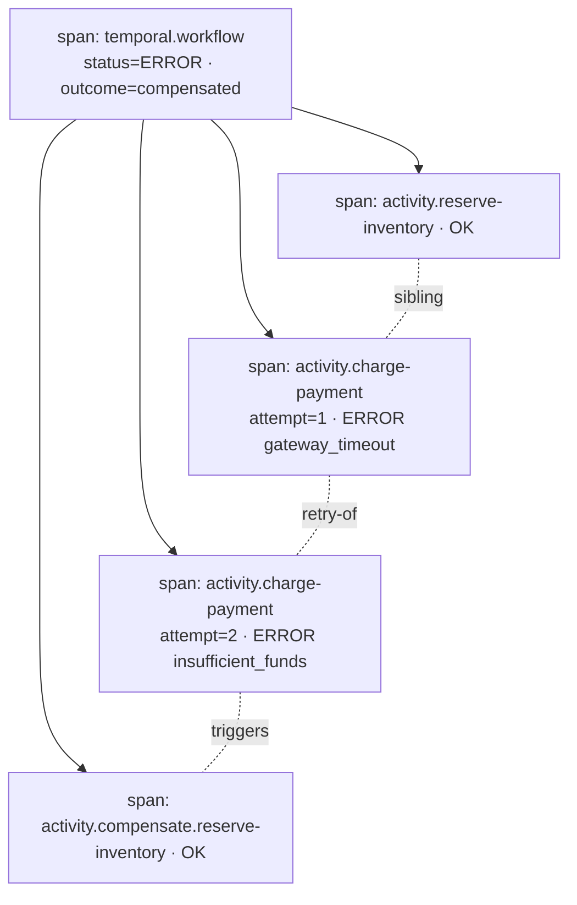

# Konzept: Temporal + Blob Storage + OpenTelemetry

> **Scope:** Protokoll und Konzept für verteilte Prozess-Orchestrierung über
> mehrere Services hinweg mit vollständiger Audit- und Trace-Fähigkeit.
>
> **Status:** Diese Seite ist die **normative Referenz** für die hier
> gesammelten Guides und Nachschlagewerke. Produktionshärtung,
> Migrations- und Betriebsthemen werden bewusst nicht behandelt; sie
> gehören in einen separaten Hardening-Track.

## 1. Grundidee in einem Satz

> **Temporal** ist das **Prozess-Hauptbuch**, **Blob Storage** ist der
> **Payload-Tresor**, und **OpenTelemetry** ist das **Nervensystem**, das
> beides über Service-Grenzen hinweg verbindet.

Damit entstehen drei klar getrennte Zustandsschichten:

| Schicht        | Träger         | Inhalt                                                                              |
| -------------- | -------------- | ----------------------------------------------------------------------------------- |
| Orchestrierung | Temporal       | Workflow- und Run-IDs, Activities, Retries, Kompensationen, Event History           |
| Payload        | Blob Storage   | Inhaltsadressierte Datenblobs (SHA-256-verifiziert), Metadaten (Claim-Check-Pattern) |
| Observability  | OpenTelemetry  | Traces, Spans, Logs, Business-Korrelations-IDs                                      |

Diese Trennung hält die Temporal-History schlank, erlaubt beliebig große
Nutzdaten und macht jeden Seiteneffekt genau **einem Workflow-Schritt** und
**einer Blob-Referenz** zuordenbar.

---

## 2. Architekturüberblick



---

## 3. Kanonischer Envelope

Jeder Hop zwischen Services trägt **denselben Envelope**, niemals die
Nutzdaten selbst. Der Envelope ist der Vertrag: alle Felder sind sichtbar,
keine versteckten Seitenkanäle.

### 3.1 JSON-Beispiel

```jsonc
{
  "workflow_id": "order-tx-789",
  "run_id": "run-456",
  "business_tx_id": "tx-789",
  "parent_step_id": "start",
  "step_id": "reserve-inventory",
  "payload_ref": {
    "blob_url": "workflows/tx-789/input.json",
    "sha256": "…",
    "etag": "0x8da4f1c93b7e9f2a"
  },
  "traceparent": "00-<trace-id>-<span-id>-01",
  "tracestate": "",
  "baggage": { "correlation.id": "tx-789" },
  "schema_version": "1.0",
  "content_type": "application/json",
  "idempotency_key": "tx-789:reserve-inventory:1.0"
}
```

### 3.2 Felder

Kurz beschrieben, gruppiert nach Concern. Details, Formate und
Invarianten stehen in den Guides.

**Prozess-Hauptbuch (Temporal).**

| Feld               | Beschreibung                                                                                                  |
| ------------------ | ------------------------------------------------------------------------------------------------------------- |
| `workflow_id`      | Deterministische Geschäfts-ID des Workflows. Primärschlüssel in der Temporal Event History.                   |
| `run_id`           | Von Temporal vergebene Lauf-ID. Unterscheidet mehrere Ausführungen desselben `workflow_id`.                   |
| `parent_step_id`   | Vorheriger Schritt in der Saga. Erlaubt Rekonstruktion der Kette. Bei Workflow-Start: `null`.                 |
| `step_id`          | Logischer Name des aktuellen Aktivitätsschritts. Landet als Span-Attribut.                                    |
| `idempotency_key`  | Deduplikations-Schlüssel für Activity-Retries. Format: `{business_tx_id}:{step_id}:{schema_version}`.         |

**Payload-Tresor (Blob Storage).**

| Feld                   | Beschreibung                                                                                                      |
| ---------------------- | ----------------------------------------------------------------------------------------------------------------- |
| `payload_ref.blob_url` | **Pflicht.** Pfad oder URL zum Blob. Konvention: `workflows/{business_tx_id}/{step_id}.json`.                     |
| `payload_ref.sha256`   | **Pflicht.** Hex-SHA-256 des Byte-Inhalts. Einzige backend-unabhängige Integritätsgarantie.                       |
| `payload_ref.etag`     | **Optional.** Vom Storage Backend nach dem Schreiben geliefert (Schreibantwort oder Properties-Read).             |
| `content_type`         | MIME-Typ des referenzierten Payloads. Default: `application/json`.                                                |

**Nervensystem (OpenTelemetry).**

| Feld            | Beschreibung                                                                                             |
| --------------- | -------------------------------------------------------------------------------------------------------- |
| `business_tx_id`| Fachliche Korrelations-ID. Stabil über Workflow-Restarts und Child-Workflows hinweg.                     |
| `traceparent`   | W3C Trace Context Header. Verknüpft Spans über Service-Grenzen hinweg.                                   |
| `tracestate`    | W3C Trace Context Begleitkontext. Vendor-spezifische Trace-Zustände.                                     |
| `baggage`       | W3C Baggage. Fachliche Key-Value-Paare, die kontextuell propagiert werden.                               |

**Übergreifend.**

| Feld              | Beschreibung                                                                                            |
| ----------------- | ------------------------------------------------------------------------------------------------------- |
| `schema_version`  | Semver des Envelope- und Payload-Schemas. Ermöglicht Kompatibilität bei Weiterentwicklung.              |

### 3.3 Regeln

1. **Payloads sind nie Teil der Temporal-History.** Services tauschen
   **ausschließlich** den Envelope plus Blob-Referenz aus. Raw payloads
   überqueren keine Service-Grenze und landen niemals als
   Workflow-Argument, Activity-Input oder Activity-Result. Die Regel
   gilt unabhängig von der Größe und ist **keine** Optimierung, sondern
   getragen von Security, Cloud Governance und Datenschutz:
   - Temporal-Events sind für Retention, Event-Sourcing und Debugging
     langzeitstabil. Fachdaten gehören in Systeme mit fachlichen
     Retention- und Löschregeln (Blob Storage mit Lifecycle Policy,
     WORM, Legal Hold), nicht in einen Orchestrator.
   - Temporal-History ist oft breit sichtbar (Web UI, Support,
     Entwickler). Personenbezogene oder vertrauliche Daten dürfen
     diesen Sichtbarkeitsradius nicht erben.
   - Der Blob ist der **einzige** Ort, an dem der Payload liegt; damit
     greifen Verschlüsselung, Access Policies, Audit Logging und
     DSGVO-Löschansprüche an genau **einer** Stelle.
2. Jeder Service lädt den Payload selbst aus Blob Storage, führt **eine**
   lokale Fachaktion aus und persistiert das Ergebnis in seiner **eigenen**
   Datenbank.
3. Der Service meldet Erfolg oder Fehler als Activity-Resultat an
   Temporal zurück, mit identischem `business_tx_id` und einer ggf. neuen
   `payload_ref`. Das Resultat enthält **keine** Fachdaten.
4. `idempotency_key` schützt gegen Temporal-Retries. Jede Fachoperation
   prüft diesen Schlüssel, bevor sie einen Seiteneffekt durchführt.

---

## 4. Happy Path

### 4.1 Sequenzdiagramm



**Status-Propagation.** Der HTTP-Aufruf an Service A endet mit
`202 Accepted`, sobald der Workflow gestartet ist. Der Endzustand wird
entkoppelt vom Ingress-Request ausgeliefert: über einen Status-Endpunkt,
einen Webhook oder einen Event-Stream. Externe Clients sprechen nicht
direkt mit dem Orchestrator; die Übersetzung „Workflow-Status in
fachliche Repräsentation" liegt im Entry Service.

### 4.2 Span-Baum



Jeder Span trägt als Attribute mindestens:
`business_tx_id`, `workflow_id`, `run_id`, `step_id`,
`payload_ref_sha256`, `schema_version`.

---

## 5. Unhappy Path: Retry, Fehler und Kompensation

### 5.1 Szenario

`charge-payment` scheitert dauerhaft. Temporal löst daraufhin die
**Saga-Kompensation** aus:

1. Retry mit exponentiellem Backoff (Temporal Retry Policy).
2. Bei finalem Fehlschlag: Kompensations-Activities **rückwärts** ausführen.
3. Jeder Undo-Schritt trägt denselben Envelope plus neue `step_id`
   (z. B. `compensate.reserve-inventory`) und bleibt voll idempotent.

### 5.2 Sequenzdiagramm



### 5.3 Zustandsdiagramm



### 5.4 Span-Baum



Dank identischem `business_tx_id` auf **allen** Spans lässt sich der
komplette Pfad inklusive Retries und Kompensationen mit **einer** Query
im Tracing Backend rekonstruieren.

---

## 6. Traceability-Regeln

Normative Anforderungen an jede Implementierung dieses Konzepts:

1. **Korrelation.** `business_tx_id` steckt in **Span-Attributen und
   Log-Feldern**, nicht nur in Headern.
2. **Kontextpropagation.** **W3C Trace Context** (`traceparent`,
   `tracestate`) und **Baggage** werden an jeder Service-Grenze
   weitergereicht.
3. **Blob-Metadaten.** Jedes geschriebene Blob trägt die Attribute
   `workflow_id`, `run_id`, `step_id`, `schema_version`, `idempotency_key`
   als Storage-seitige Metadaten. Read-back erfolgt über die
   Properties-API des Backends.
4. **Idempotenz.** Activities sind **idempotent**. Temporal darf
   wiederholen. Jede Fachoperation prüft `idempotency_key`, bevor sie
   einen Seiteneffekt durchführt.
5. **Metriken-Cardinality.** Hochkardinale IDs (`business_tx_id`,
   `workflow_id`, `run_id`) gehören **nicht** in Metrik-Labels, nur in
   Traces und Logs. Metrik-Dimensionen bleiben niedrigkardinal
   (`outcome`, `step_id`, `service`).
6. **Zuordenbarkeit.** Jeder persistierte Seiteneffekt ist **genau einem**
   Workflow-Schritt **und einer** Blob-Referenz zuordenbar.

---

## 7. Referenzen nach Concern

### Prozess-Hauptbuch (Temporal)

- Temporal: [_Error handling in distributed systems_](https://temporal.io/blog/error-handling-in-distributed-systems)
- Temporal: [_Idempotency and durable execution_](https://temporal.io/blog/idempotency-and-durable-execution)
- Temporal Docs: [_External storage for large payloads_](https://docs.temporal.io/external-storage)
- Federico Bevione (dev.to): [_Transactions in Microservices, Part 3: Saga Pattern with Orchestration and Temporal.io_](https://dev.to/federico_bevione/transactions-in-microservices-part-3-saga-pattern-with-orchestration-and-temporalio-3e17)

### Payload-Tresor (Blob Storage)

- Microsoft Learn: [_Durable Task Scheduler: large payloads_](https://learn.microsoft.com/en-us/azure/durable-task/scheduler/durable-task-scheduler-large-payloads)
- Microsoft Learn: [_Immutable storage for Azure Blob Storage (Overview)_](https://learn.microsoft.com/en-us/azure/storage/blobs/immutable-storage-overview)

### Nervensystem (OpenTelemetry)

- OpenTelemetry: [_Baggage_](https://opentelemetry.io/docs/concepts/signals/baggage/)
- OpenTelemetry: [_Context Propagation_](https://opentelemetry.io/docs/concepts/context-propagation/)
- W3C: [_Trace Context_](https://www.w3.org/TR/trace-context/)
- W3C: [_Propagation format for distributed context: Baggage_](https://www.w3.org/TR/baggage/)
- OneUptime: [_Instrument Temporal.io workflows with OpenTelemetry_](https://oneuptime.com/blog/post/2026-02-06-instrument-temporal-io-workflows-opentelemetry/view)
