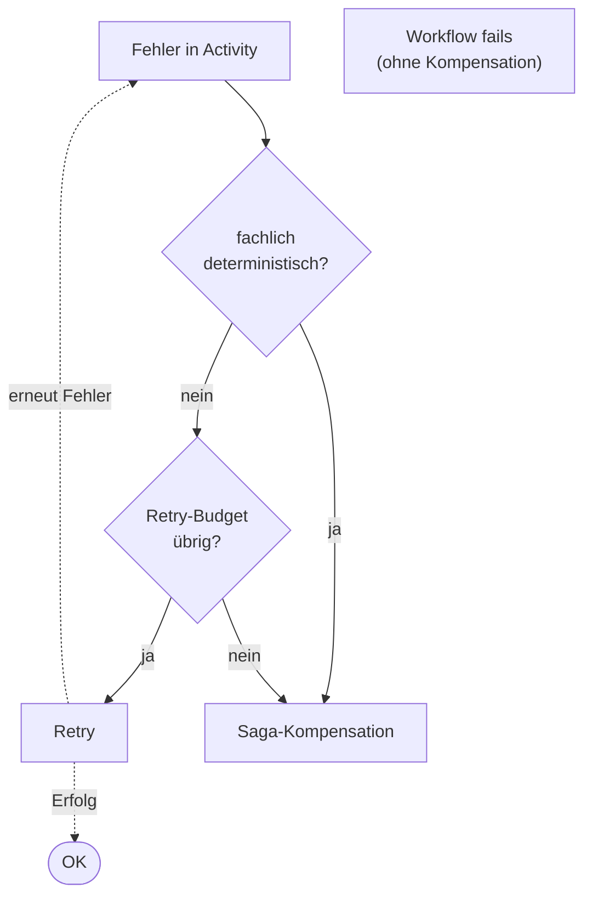

# Reference: Fehlertaxonomie

Klassifikation von Fehlern in Saga-Activities und ihre Wirkung auf
Retry und Kompensation.

## Dimensionen

- **Herkunft:** infrastrukturell (Netzwerk, Storage, Clock) oder fachlich
  (Geschäftsregel verletzt).
- **Wiederholbarkeit:** retryable (Wiederholung kann Erfolg bringen)
  oder non-retryable (Wiederholung ist sinnlos).
- **Kompensationsbedarf:** löst Saga-Kompensation aus oder wird
  geschluckt.

## Kategorien

### 1. Transient retryable

Typische Beispiele: `TimeoutError`, `GatewayTimeout`, `ConnectionReset`,
temporäre `5xx` vom Upstream, `429 Too Many Requests`.

- **Retry:** ja, mit exponentiellem Backoff.
- **Kompensation:** nein, solange Retry-Budget nicht erschöpft.
- **Envelope:** bleibt unverändert. Attempt wird als Span-Attribut
  gespiegelt.

### 2. Transient ausgeschöpft

Transienter Fehler, aber `maximum_attempts` oder
`schedule_to_close_timeout` erreicht.

- **Retry:** nein, Budget vorbei.
- **Kompensation:** ja, rückwärts ab letztem erfolgreichen Schritt.
- **Activity-Resultat:** finaler Fehler wird als Activity-Failure
  gemeldet.

### 3. Non-retryable fachlich

Deterministische Geschäftsentscheidung: `InsufficientFunds`,
`OutOfStock`, `ValidationError`. Wiederholung liefert denselben Fehler.

- **Retry:** nein. Fehlertyp steht in `non_retryable_error_types` der
  Retry Policy.
- **Kompensation:** ja, sofort.
- **Activity-Resultat:** Fehler wird als non-retryable markiert.

### 4. Non-retryable infrastrukturell

Wiederholung ist sinnlos, obwohl Infrastruktur: fehlende Permissions,
falsches Deployment, Schema-Mismatch (`schema_version` unpassend).

- **Retry:** nein.
- **Kompensation:** ja.
- **Handlung:** Operator-Alert; das ist ein Deployment-Fehler, kein
  Fachfehler.

### 5. Panic / Activity-Kontext verloren

Worker-Crash, Host weggefallen, `ActivityCancelled`.

- **Retry:** ja, sobald Heartbeat/Schedule abgelaufen ist. Temporal
  schedulet neu.
- **Kompensation:** nein.
- **Envelope:** unverändert.

## Entscheidungsbaum

## Kompensations-Semantik

- **Reverse-Order.** Kompensation läuft in umgekehrter Reihenfolge zu
  den erfolgreichen Vorwärtsschritten.
- **Isoliert.** Jede Kompensations-Activity hat ihren eigenen
  `try/catch`. Scheitert eine, laufen die übrigen trotzdem.
- **Idempotent.** Kompensation ist wie die Vorwärts-Activity
  idempotent. Doppelte Ausführung ist harmlos.
- **Step-Naming.** Kompensationsschritte tragen das Präfix `compensate.`
  vor dem Namen des ursprünglichen Schritts
  (z. B. `compensate.reserve-inventory`).

## Fehlerfelder im Activity-Resultat

| Feld            | Quelle                                                          |
| --------------- | --------------------------------------------------------------- |
| `error.type`    | fully qualified Fehlerklasse, z. B. `InsufficientFundsError`    |
| `error.message` | kurze menschenlesbare Nachricht, ohne PII                       |
| `non_retryable` | Boolean, vom Worker gesetzt bzw. aus Retry Policy abgeleitet    |
| `attempt`       | 1-basiert, wird bei jedem Retry inkrementiert                   |

## Siehe auch

- [Reference: Regeln](regeln.md) (T-4, T-5, O-4)
- [Guide: Retry Policy wählen](../guides/temporal/retry-policy-waehlen.md)
- [Guide: Kompensation verdrahten](../guides/temporal/kompensation-verdrahten.md)
