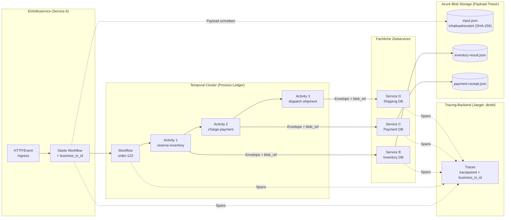
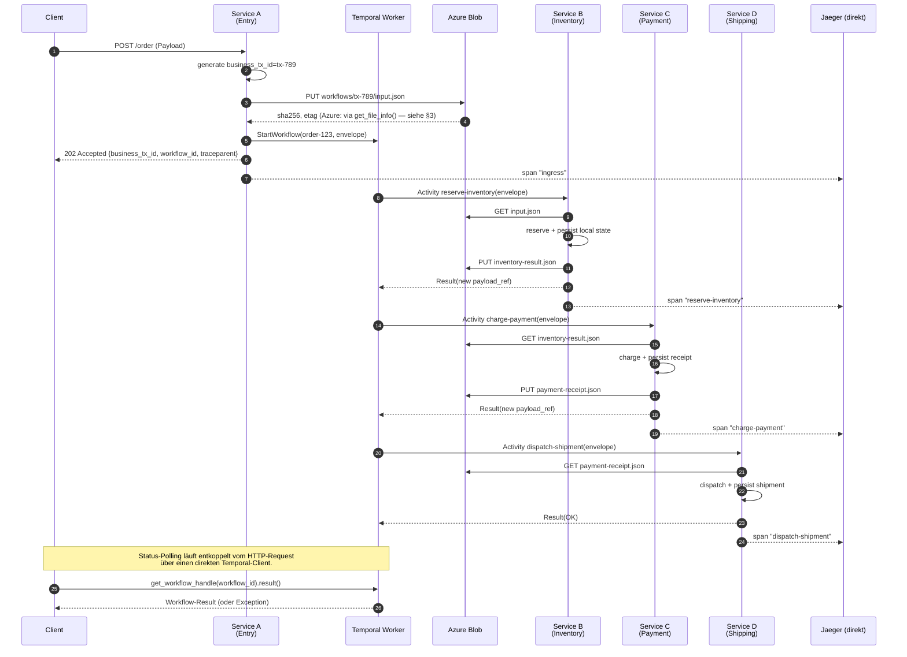
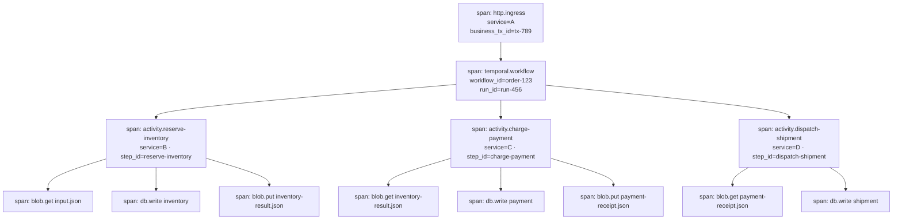
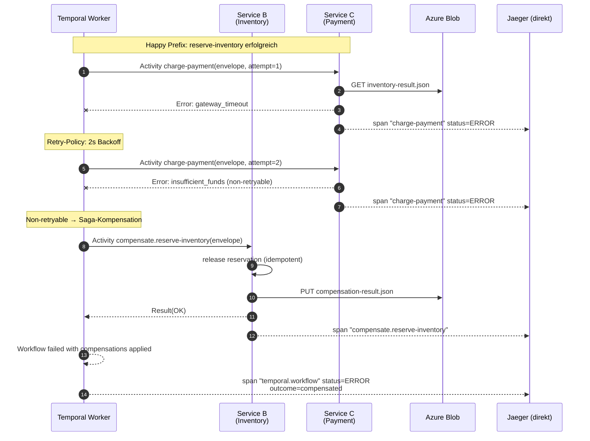
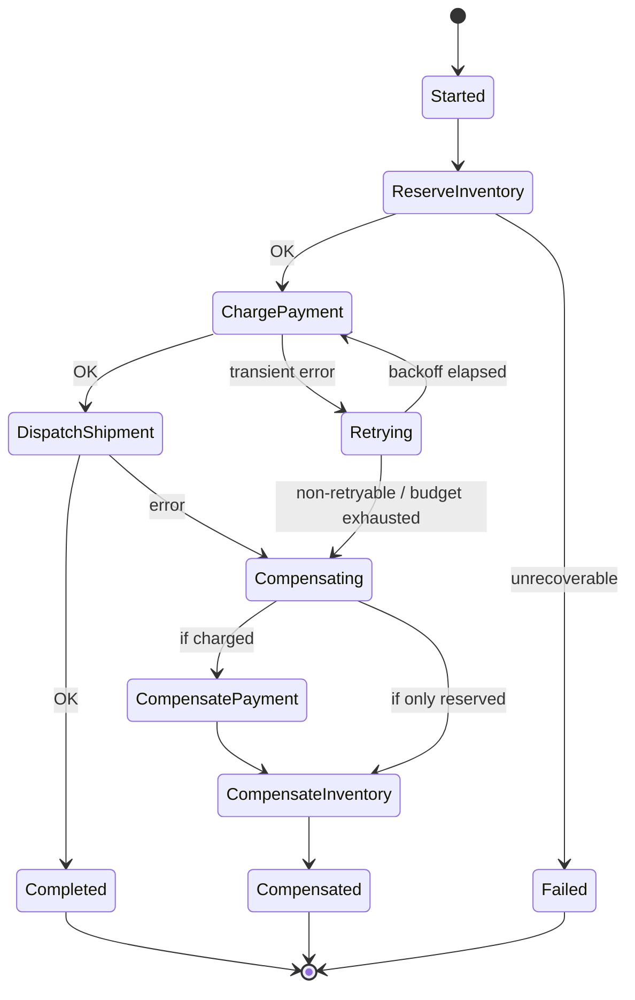
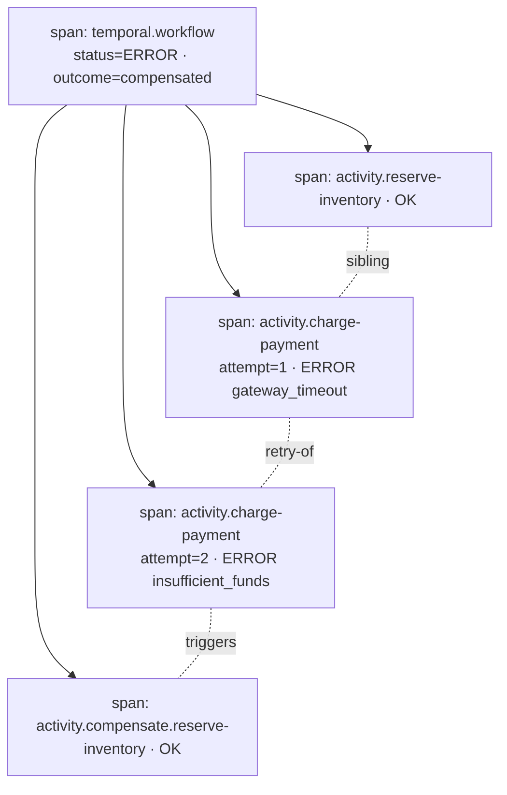

# Konzept: Temporal + Azure Blob + OpenTelemetry

> **Scope:** Protokoll und Konzept für verteilte Prozess-Orchestrierung über
> mehrere Services hinweg mit vollständiger Audit- und Trace-Fähigkeit.

## 1. Grundidee in einem Satz

> **Temporal** ist das **Prozess-Hauptbuch**, **Azure Blob Storage** ist der
> **Payload-Tresor**, und **OpenTelemetry** ist das **Nervensystem**, das
> beides über Service-Grenzen hinweg verbindet.

Damit entstehen drei klar getrennte Zustandsschichten:

| Schicht        | Träger             | Inhalt                                                                              |
| -------------- | ------------------ | ----------------------------------------------------------------------------------- |
| Orchestrierung | Temporal           | Workflow-/Run-IDs, Activities, Retries, Kompensationen, Event History               |
| Payload        | Azure Blob Storage | Inhaltsadressierte Datenblobs (SHA-256-verifiziert), Metadaten (Claim-Check-Pattern) |
| Observability  | OpenTelemetry      | Traces, Spans, Logs, Business-Korrelations-IDs                                      |

Diese Trennung hält die Temporal-History schlank, erlaubt beliebig große
Nutzdaten und macht jeden Seiteneffekt genau **einem Workflow-Schritt** und
**einer Blob-Referenz** zuordenbar.

---

## 2. Architekturüberblick



---

## 3. Kanonischer Envelope

Jeder Hop zwischen Services trägt **denselben Umschlag** – niemals die
Nutzdaten selbst:

```jsonc
{
  "workflow_id": "order-123",
  "run_id": "run-456",
  "business_tx_id": "tx-789",
  "parent_step_id": "start",
  "step_id": "reserve-inventory",
  "payload_ref": {
    "blob_url": "https://acct.blob.core.windows.net/workflows/tx-789/input.json",
    "sha256": "…",                    // Pflicht — backend-unabhängige Integrität
    "etag": "0x8da4f1c93b7e9f2a",     // Azure/Azurite: via get_file_info() befüllt; MemoryBackend: ""
    "version_id": ""                  // reserviert; Azure-Versionierung nicht aktiv (BK-003)
  },
  "traceparent": "00-<trace-id>-<span-id>-01",
  "baggage": { "correlation.id": "tx-789" },
  "schema_version": "1.0",
  "content_type": "application/json",
  "idempotency_key": "tx-789:reserve-inventory:v1"
}
```

**Regeln:**

1. Services tauschen **ausschließlich** den Envelope plus Blob-Referenz aus.
2. Jeder Service lädt den Payload selbst aus Blob Storage, führt **eine**
   lokale Fachaktion aus und persistiert das Ergebnis in seiner **eigenen**
   Datenbank.
3. Der Service meldet Erfolg/Fehler als Activity-Resultat zurück an Temporal
   mit demselben `business_tx_id` und einer ggf. neuen `payload_ref`.
4. `idempotency_key` schützt gegen Temporal-Retries (Activities dürfen
   mehrfach ausgeführt werden).

**Pflicht- vs. optionale Felder in `payload_ref`:**

- `blob_url` und `sha256` sind **Pflicht**. `sha256` ist die einzige
  Integritätsgarantie, die backend-unabhängig gilt: jeder Konsument
  kann das geladene Blob lokal verifizieren.
- `etag` wird nach jedem Schreibvorgang über `Store.get_file_info()` befüllt,
  wenn das Backend die `METADATA`-Capability unterstützt. Azure/Azurite:
  stets nicht-leer (z. B. `"0x8da4f1c93b7e9f2a"`). `MemoryBackend`: stets `""`
  – es unterstützt METADATA, aber `FileInfo.etag` ist `None` und wird
  normalisiert. `version_id` bleibt leer – Azure-Blob-Versionierung ist im
  Showcase nicht aktiviert (BK-003).

---

## 4. Happy Path – Spans & Flow

### 4.1 Sequenzdiagramm (Happy Path)



**Status-Polling.** Der HTTP-Aufruf an Service A endet mit `202 Accepted`,
sobald der Workflow gestartet ist. Den Endzustand liest der Aufrufer
**direkt am Temporal-Cluster** ab (`get_workflow_handle(workflow_id).result()`),
nicht über einen weiteren HTTP-Aufruf an Service A. Das hält Service A
zustandslos und entkoppelt die Wartezeit vom HTTP-Request. Im Showcase
implementieren das die Szenario-Skripte
(`scenarios/_common.py::await_workflow`); ein Produktivsystem würde an
dieser Stelle einen Status-Endpunkt, ein Webhook-Callback oder einen
Event-Stream anbieten (siehe §9 Produktionshärtung).

### 4.2 Span-Baum (Happy Path)



**Alle Spans** tragen als Attribute mindestens:
`business_tx_id`, `workflow_id`, `run_id`, `step_id`, `payload_ref_sha256`,
`schema_version` (so wie sie auch in `shared/otel.py::set_envelope_span_attrs`
gesetzt werden).

---

## 5. Unhappy Path – Retry, Fehler & Kompensation

### 5.1 Szenario

`charge-payment` scheitert dauerhaft → Temporal löst **Saga-Kompensation**
aus:

1. Retry mit exponentiellem Backoff (Temporal-Retry-Policy).
2. Bei finalem Fehlschlag: Kompensations-Activities **rückwärts** ausführen.
3. Jeder Undo-Schritt trägt denselben Envelope + neue `step_id`
   (z. B. `compensate.reserve-inventory`) und bleibt voll idempotent.

### 5.2 Sequenzdiagramm (Unhappy Path)



### 5.3 Zustandsdiagramm (Workflow-Outcome)



### 5.4 Span-Baum (Unhappy Path)



Dank identischem `business_tx_id` auf **allen** Spans lässt sich der
komplette Pfad – inklusive Retries und Kompensationen – mit **einer** Query
im Tracing-Backend rekonstruieren.

---

## 6. Traceability-Regeln (Checkliste)

- [ ] `business_tx_id` steckt in **Span-Attributen UND Log-Feldern**, nicht
      nur in Headern.
- [ ] **W3C Trace Context** (`traceparent`) + **Baggage** an jeder
      Service-Grenze propagieren.
- [x] Blob-**Metadaten** enthalten `workflow_id`, `run_id`, `step_id`,
      `schema_version`, `idempotency_key` (IS-014, via
      `Envelope.blob_metadata()` an `shared.blob.upload(metadata=…)`).
      Read-back via Azure Blob SDK: `BlobClient.get_blob_properties().metadata`.
- [ ] Activities sind **idempotent** (Temporal darf wiederholen) –
      `idempotency_key` in jeder Fachoperation prüfen.
- [ ] **Optional / Erweiterung:** Sobald Metriken eingeführt werden,
      gilt die Cardinality-Regel: hohe Kardinalitäts-IDs (`business_tx_id`,
      `workflow_id`, `run_id`) gehören **nicht** in Metrik-Labels – nur in
      Traces und Logs. Im Showcase aktuell nicht umgesetzt; siehe §9.
- [ ] Jeder persistierte Seiteneffekt ist **genau einem** Workflow-Schritt
      **und einer** Blob-Referenz zuordenbar.

---

## 7. Glossar & Feldherkunft

| Feld              | Schicht           | Definition / Herkunft                                                                                                    |
| ----------------- | ----------------- | ------------------------------------------------------------------------------------------------------------------------ |
| `workflow_id`     | Prozess-Hauptbuch | Eindeutige Geschäfts-ID des Workflows, vom Starter vergeben; Primärschlüssel in der Temporal Event History.              |
| `run_id`          | Prozess-Hauptbuch | Von Temporal vergebene Lauf-ID; unterscheidet mehrere Ausführungen desselben `workflow_id`.                              |
| `business_tx_id`  | Nervensystem      | Fachliche Korrelations-ID; stabil über Workflow-Restarts/Child-Workflows.                                                |
| `parent_step_id`  | Prozess-Hauptbuch | Vorheriger Schritt in der Saga; erlaubt Rekonstruktion der Kette.                                                        |
| `step_id`         | Prozess-Hauptbuch | Logischer Name des aktuellen Aktivitätsschritts; landet als Span-Attribut.                                               |
| `payload_ref`     | Payload-Tresor    | Claim-Check-Referenz auf das Blob.                                                                                       |
| `traceparent`     | Nervensystem      | W3C Trace Context Header; verknüpft Spans über Service-Grenzen hinweg.                                                   |
| `baggage`         | Nervensystem      | W3C Baggage: fachliche Key-Value-Paare, die kontextuell propagiert werden.                                               |
| `schema_version`  | übergreifend      | Semver des Envelope-/Payload-Schemas; ermöglicht Kompatibilität bei Weiterentwicklung.                                   |
| `idempotency_key` | Prozess-Hauptbuch | Deduplikations-Schlüssel für Activity-Retries; Formel: `business_tx_id:step_id:schema_version`.                          |

---

## 8. Referenzen nach Concern

### Prozess-Hauptbuch (Temporal)

- Temporal – [_Error handling in distributed systems_](https://temporal.io/blog/error-handling-in-distributed-systems)
- Temporal – [_Idempotency and durable execution_](https://temporal.io/blog/idempotency-and-durable-execution)
- Temporal AI Cookbook – [_Claim-check pattern (Python)_](https://docs.temporal.io/ai-cookbook/claim-check-pattern-python)
- Temporal Docs – [_External storage for large payloads_](https://docs.temporal.io/external-storage)
- Federico Bevione (dev.to) – [_Transactions in Microservices, Part 3: Saga Pattern with Orchestration and Temporal.io_](https://dev.to/federico_bevione/transactions-in-microservices-part-3-saga-pattern-with-orchestration-and-temporalio-3e17)

### Payload-Tresor (Azure Blob Storage)

- Microsoft Learn – [_Durable Task Scheduler: large payloads_](https://learn.microsoft.com/en-us/azure/durable-task/scheduler/durable-task-scheduler-large-payloads)
- Microsoft Learn – [_Immutable storage for Azure Blob Storage (Overview)_](https://learn.microsoft.com/en-us/azure/storage/blobs/immutable-storage-overview)
- OneUptime – [_How to configure Azure Blob Storage retention policies for compliance_](https://oneuptime.com/blog/post/2026-02-16-how-to-configure-azure-blob-storage-retention-policies-for-compliance/view)

### Nervensystem (OpenTelemetry)

- Temporal Docs – [_Observability: Python SDK_](https://docs.temporal.io/develop/python/observability)
- Temporal Docs – [_temporalio.contrib.opentelemetry (API-Referenz)_](https://python.temporal.io/temporalio.contrib.opentelemetry.html)
- OpenTelemetry – [_Baggage_](https://opentelemetry.io/docs/concepts/signals/baggage/)
- OpenTelemetry – [_Context Propagation_](https://opentelemetry.io/docs/concepts/context-propagation/)
- W3C – [_Propagation format for distributed context: Baggage_](https://www.w3.org/TR/baggage/)
- W3C – [_Trace Context_](https://www.w3.org/TR/trace-context/)
- OneUptime – [_Instrument Temporal.io workflows with OpenTelemetry_](https://oneuptime.com/blog/post/2026-02-06-instrument-temporal-io-workflows-opentelemetry/view) _(praktisches Beispiel)_

---

## 9. Produktionshärtung

Der Showcase demonstriert die **Architektur-Invarianten** (Envelope, Claim
Check, Trace-Propagation, Saga-Kompensation). Die folgenden Themen sind
für einen Produktivbetrieb zwingend, würden den Demo-Aufbau aber
unverhältnismäßig vergrößern und sind daher bewusst ausgegrenzt. Sie
gehören in einen separaten Hardening-Track.

### 9.1 OTel Collector statt direkter Exporter

Der Showcase exportiert OTLP **direkt an Jaeger** (`OTEL_EXPORTER_OTLP_ENDPOINT=jaeger:4317`).
Im Produktivbetrieb gehört zwischen Service und Backend ein
OpenTelemetry Collector – für Batching, Sampling, Re-Routing,
Anreicherung (z. B. Resource-Attribute aus Kubernetes-Downward-API) und
Backend-Failover. Eine fertige Collector-Konfiguration liegt im
Repository (`otel-collector-config.yaml`); aktiviert wird sie über das
Backlog-Item `BK-ext-collector`.

### 9.2 OTLP-Logs statt stdout-JSON

Logs werden derzeit als strukturiertes JSON auf stdout geschrieben und
landen ausschließlich in den Container-Logs. Korrelation mit Traces ist
nur über `trace_id`/`span_id`-Suche im Log-Aggregator möglich. Ein
OTLP-Log-Exporter liefert Logs am gleichen Pipeline-Endpunkt wie Traces
und erlaubt im Tracing-Backend echtes "Logs in Span"-Drilldown.

### 9.3 Metriken & Cardinality-Disziplin

Der Showcase exportiert keine Metriken; die Cardinality-Regel aus §6 ist
eine Vorgabe für ihre spätere Einführung: hoch-kardinale Korrelations-IDs
(`business_tx_id`, `workflow_id`, `run_id`) bleiben in Traces und Logs.
In Metriken erscheinen nur niedrig-kardinale Dimensionen wie `outcome`,
`step_id`, `service`. Erste Kandidaten: ein Counter
`saga_completed_total{outcome}` und ein Histogramm
`saga_duration_seconds`.

### 9.4 Blob-Immutability & Versionierung

Der Showcase schreibt Blobs einmal und liest sie erneut – aber **erzwingt**
keine Unveränderlichkeit. In Compliance-Umgebungen (Audit, Finanz,
Gesundheit) gehören Workflow-Container hinter:

- **Immutability-Policies (WORM)** mit `immutabilityPolicyMode = Locked`
  und definierter Retention,
- **Legal Holds** für laufende Rechtsverfahren,
- **Blob-Versionierung** auf Account-Ebene, sodass Überschreibversuche
  als neue Version landen und der ursprüngliche Blob unverändert bleibt
  (liefert dann auch die `version_id` im Envelope),
- **Soft Delete** für Container und Blobs als zusätzliche Sicherung
  gegen versehentliches Löschen.

Die Integritätsgarantie des Showcase bleibt der `sha256` im Envelope –
unabhängig davon, ob das Storage-Backend zusätzlich WORM erzwingt.

### 9.5 Status-Endpunkt statt Direkt-Polling am Cluster

Im Showcase pollen die Szenario-Skripte den Workflow-Status **direkt am
Temporal-Cluster** (siehe §4.1 "Status-Polling"). Externe Clients dürfen
in einem Produktivsystem nicht direkt mit dem Orchestrator sprechen.
Stattdessen exponiert Service A einen Status-Endpunkt
(`GET /order/{business_tx_id}`), der intern `describe()` aufruft und das
Ergebnis in eine fachliche Repräsentation übersetzt. Alternativen:
Webhook-Callback, Server-Sent Events, oder ein Event-Stream (Kafka,
Service Bus) für Domain-Ereignisse.
