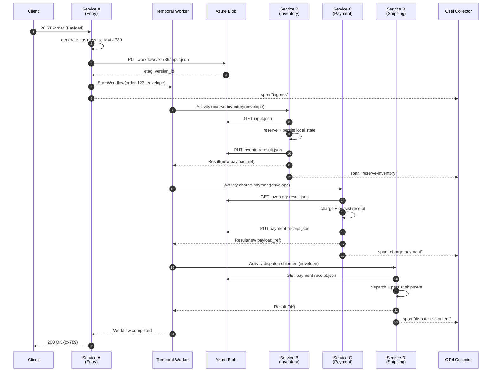
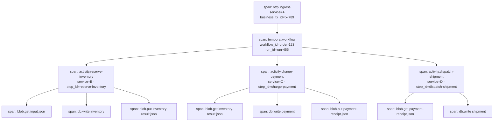
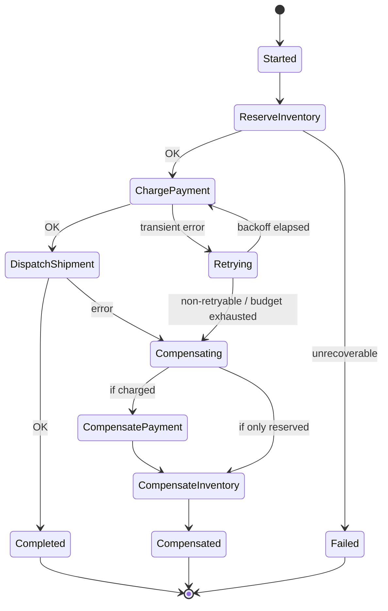
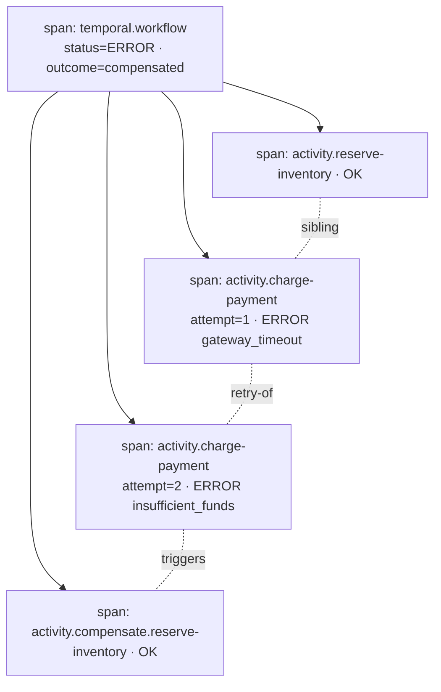

# Konzept: Temporal + Azure Blob + OpenTelemetry

> **Scope:** Protokoll und Konzept für verteilte Prozess-Orchestrierung über
> mehrere Services hinweg mit vollständiger Audit- und Trace-Fähigkeit.

## 1. Grundidee in einem Satz

> **Temporal** ist das **Prozess-Hauptbuch**, **Azure Blob Storage** ist der
> **Payload-Tresor**, und **OpenTelemetry** ist das **Nervensystem**, das
> beides über Service-Grenzen hinweg verbindet [^temporal-ext] [^azure-lp]
> [^otel-temporal].

Damit entstehen drei klar getrennte Zustandsschichten:

| Schicht              | Träger              | Inhalt                                                                 |
|----------------------|---------------------|------------------------------------------------------------------------|
| Orchestrierung       | Temporal            | Workflow-/Run-IDs, Activities, Retries, Kompensationen, Event History [^temporal-err] |
| Payload              | Azure Blob Storage  | Unveränderliche Datenblobs, Versionen, Metadaten (Claim-Check-Pattern) [^temporal-claim] |
| Observability        | OpenTelemetry       | Traces, Spans, Logs, Business-Korrelations-IDs [^otel-corr]            |

Diese Trennung hält die Temporal-History schlank, erlaubt beliebig große
Nutzdaten und macht jeden Seiteneffekt genau **einem Workflow-Schritt** und
**einer Blob-Referenz** zuordenbar [^temporal-idem].

---

## 2. Architekturüberblick


---

## 3. Kanonischer Envelope

Jeder Hop zwischen Services trägt **denselben Umschlag** — niemals die
Nutzdaten selbst [^temporal-claim] [^otel-corr]:

```json
{
  "workflow_id":    "order-123",
  "run_id":         "run-456",
  "business_tx_id": "tx-789",
  "parent_step_id": "start",
  "step_id":        "reserve-inventory",
  "payload_ref": {
    "blob_url":   "https://acct.blob.core.windows.net/workflows/tx-789/input.json",
    "etag":       "\"0x8DB...\"",
    "version_id": "2026-04-15T12:34:56.0000000Z",
    "sha256":     "…"
  },
  "traceparent":    "00-<trace-id>-<span-id>-01",
  "baggage":        { "correlation.id": "tx-789" },
  "schema_version": "1.0",
  "content_type":   "application/json",
  "idempotency_key":"tx-789:reserve-inventory:v1"
}
```

**Regeln:**

1. Services tauschen **ausschließlich** den Envelope plus Blob-Referenz aus
   [^temporal-ext].
2. Jeder Service lädt den Payload selbst aus Blob Storage, führt **eine**
   lokale Fachaktion aus und persistiert das Ergebnis in seiner **eigenen**
   Datenbank [^saga].
3. Der Service meldet Erfolg/Fehler als Activity-Resultat zurück an Temporal
   mit demselben `business_tx_id` und einer ggf. neuen `payload_ref`
   [^temporal-err].
4. `idempotency_key` schützt gegen Temporal-Retries (Activities dürfen
   mehrfach ausgeführt werden) [^temporal-idem].

---

## 4. Happy Path — Spans & Flow

### 4.1 Sequenzdiagramm (Happy Path)



### 4.2 Span-Baum (Happy Path)



**Alle Spans** tragen als Attribute mindestens:
`business_tx_id`, `workflow_id`, `run_id`, `step_id`, `payload_ref.etag`,
`schema_version` [^otel-corr] [^otel-prop].

---

## 5. Unhappy Path — Retry, Fehler & Kompensation

### 5.1 Szenario

`charge-payment` scheitert dauerhaft → Temporal löst **Saga-Kompensation**
aus [^temporal-err] [^saga]:

1. Retry mit exponentiellem Backoff (Temporal-Retry-Policy).
2. Bei finalem Fehlschlag: Kompensations-Activities **rückwärts** ausführen.
3. Jeder Undo-Schritt trägt denselben Envelope + neue `step_id`
   (z. B. `compensate.reserve-inventory`) und bleibt voll idempotent
   [^temporal-idem].

### 5.2 Sequenzdiagramm (Unhappy Path)


### 5.3 Zustandsdiagramm (Workflow-Outcome)



### 5.4 Span-Baum (Unhappy Path)



Dank identischem `business_tx_id` auf **allen** Spans lässt sich der
komplette Pfad — inklusive Retries und Kompensationen — mit **einer** Query
im Tracing-Backend rekonstruieren [^otel-corr].

---

## 6. Traceability-Regeln (Checkliste)

- [ ] `business_tx_id` steckt in **Span-Attributen UND Log-Feldern**, nicht
      nur in Headern [^otel-corr].
- [ ] **W3C Trace Context** (`traceparent`) + **Baggage** an jeder
      Service-Grenze propagieren [^otel-prop].
- [ ] Blob-**Metadaten** enthalten `workflow_id`, `run_id`, `step_id`,
      `schema_version` [^azure-ret].
- [ ] Activities sind **idempotent** (Temporal darf wiederholen) —
      `idempotency_key` in jeder Fachoperation prüfen [^temporal-idem].
- [ ] Hohe Kardinalitäts-IDs **nicht** in Metrik-Labels — nur Traces/Logs
      [^otel-corr].
- [ ] Jeder persistierte Seiteneffekt ist **genau einem** Workflow-Schritt
      **und einer** Blob-Referenz zuordenbar [^temporal-err].

---

## 7. Guardrails & Designentscheidungen

| Entscheidung                               | Begründung                                                        | Quelle                 |
|--------------------------------------------|-------------------------------------------------------------------|------------------------|
| Claim-Check-Pattern (nur Referenzen)       | Temporal-History klein, Replay schnell, Payloads frei skalierbar  | [^temporal-claim]      |
| Blob-I/O via remote-store                  | Backend-Wechsel (Azurite/Azure/Local) ohne Code-Änderung          | —                      |
| Fach-Outcome in Service-eigener DB         | Orchestrierung und Domänenzustand bleiben entkoppelt              | [^saga]                |
| `business_tx_id` ≠ `workflow_id`           | Fachliche Korrelation überlebt Workflow-Restarts / Child-Workflows| [^otel-corr]           |
| Kompensation als eigene Activity           | Auch Undo ist audit- und replay-fähig                             | [^temporal-err]        |
| OTel-Collector zentral                     | Einheitliches Schema für Spans aus Temporal-Worker und Services   | [^otel-temporal]       |

---

## 8. Glossar & Feldherkunft

| Feld               | Schicht            | Definition / Herkunft                                                                                                               |
|--------------------|--------------------|-------------------------------------------------------------------------------------------------------------------------------------|
| `workflow_id`      | Prozess-Hauptbuch  | Eindeutige Geschäfts-ID des Workflows, vom Starter vergeben; Primärschlüssel in der Temporal Event History [^temporal-err].         |
| `run_id`           | Prozess-Hauptbuch  | Von Temporal vergebene Lauf-ID; unterscheidet mehrere Ausführungen desselben `workflow_id` [^temporal-err].                         |
| `business_tx_id`   | Nervensystem       | Fachliche Korrelations-ID; stabil über Workflow-Restarts/Child-Workflows [^otel-corr].                                              |
| `parent_step_id`   | Prozess-Hauptbuch  | Vorheriger Schritt in der Saga; erlaubt Rekonstruktion der Kette [^saga].                                                           |
| `step_id`          | Prozess-Hauptbuch  | Logischer Name des aktuellen Aktivitätsschritts; landet als Span-Attribut [^otel-temporal].                                         |
| `payload_ref`      | Payload-Tresor     | Claim-Check-Referenz auf das Blob [^temporal-claim].                                                                                |
| `traceparent`      | Nervensystem       | W3C Trace Context Header; verknüpft Spans über Service-Grenzen hinweg [^otel-prop].                                                 |
| `baggage`          | Nervensystem       | W3C Baggage: fachliche Key-Value-Paare, die kontextuell propagiert werden [^otel-prop].                                             |
| `schema_version`   | übergreifend       | Semver des Envelope-/Payload-Schemas; ermöglicht Kompatibilität bei Weiterentwicklung.                                              |
| `idempotency_key`  | Prozess-Hauptbuch  | Deduplikations-Schlüssel für Activity-Retries; Formel: `business_tx_id:step_id:schema_version` [^temporal-idem].                    |

---

## 9. Referenzen nach Concern

### 9.1 Prozess-Hauptbuch (Temporal)

- [^temporal-err]: Temporal — *Error handling in distributed systems*.
  <https://temporal.io/blog/error-handling-in-distributed-systems>
- [^temporal-idem]: Temporal — *Idempotency and durable execution*.
  <https://temporal.io/blog/idempotency-and-durable-execution>
- [^temporal-claim]: Temporal AI Cookbook — *Claim-check pattern (Python)*.
  <https://docs.temporal.io/ai-cookbook/claim-check-pattern-python>
- [^temporal-ext]: Temporal Docs — *External storage for large payloads*.
  <https://docs.temporal.io/external-storage>
- [^saga]: Federico Bevione (dev.to) — *Transactions in Microservices,
  Part 3: Saga Pattern with Orchestration and Temporal.io*.
  <https://dev.to/federico_bevione/transactions-in-microservices-part-3-saga-pattern-with-orchestration-and-temporalio-3e17>

### 9.2 Payload-Tresor (Azure Blob Storage)

- [^azure-lp]: Microsoft Learn — *Durable Task Scheduler: large payloads*.
  <https://learn.microsoft.com/en-us/azure/durable-task/scheduler/durable-task-scheduler-large-payloads>
- [^azure-immut]: Microsoft Learn — *Immutable storage for Azure Blob Storage (Overview)*.
  <https://learn.microsoft.com/en-us/azure/storage/blobs/immutable-storage-overview>
- [^azure-ret]: OneUptime — *How to configure Azure Blob Storage retention policies for compliance*.
  <https://oneuptime.com/blog/post/2026-02-16-how-to-configure-azure-blob-storage-retention-policies-for-compliance/view>

### 9.3 Nervensystem (OpenTelemetry)

- [^otel-temporal]: OneUptime — *Instrument Temporal.io workflows with OpenTelemetry*.
  <https://oneuptime.com/blog/post/2026-02-06-instrument-temporal-io-workflows-opentelemetry/view>
- [^otel-corr]: OneUptime — *OTel request-scoped correlation IDs*.
  <https://oneuptime.com/blog/post/2026-02-06-otel-request-scoped-correlation-ids/view>
- [^otel-prop]: OneUptime — *Distributed tracing context propagation*.
  <https://oneuptime.com/blog/post/2026-02-02-distributed-tracing-context-propagation/view>

[^temporal-err]: <https://temporal.io/blog/error-handling-in-distributed-systems>
[^temporal-idem]: <https://temporal.io/blog/idempotency-and-durable-execution>
[^temporal-claim]: <https://docs.temporal.io/ai-cookbook/claim-check-pattern-python>
[^temporal-ext]: <https://docs.temporal.io/external-storage>
[^saga]: <https://dev.to/federico_bevione/transactions-in-microservices-part-3-saga-pattern-with-orchestration-and-temporalio-3e17>
[^azure-lp]: <https://learn.microsoft.com/en-us/azure/durable-task/scheduler/durable-task-scheduler-large-payloads>
[^azure-immut]: <https://learn.microsoft.com/en-us/azure/storage/blobs/immutable-storage-overview>
[^azure-ret]: <https://oneuptime.com/blog/post/2026-02-16-how-to-configure-azure-blob-storage-retention-policies-for-compliance/view>
[^otel-temporal]: <https://oneuptime.com/blog/post/2026-02-06-instrument-temporal-io-workflows-opentelemetry/view>
[^otel-corr]: <https://oneuptime.com/blog/post/2026-02-06-otel-request-scoped-correlation-ids/view>
[^otel-prop]: <https://oneuptime.com/blog/post/2026-02-02-distributed-tracing-context-propagation/view>
